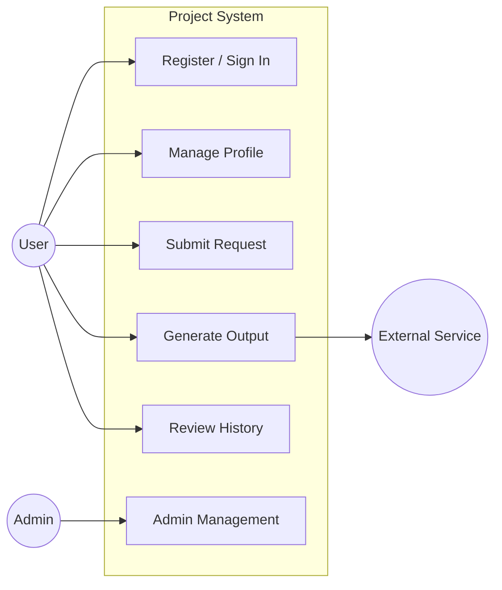
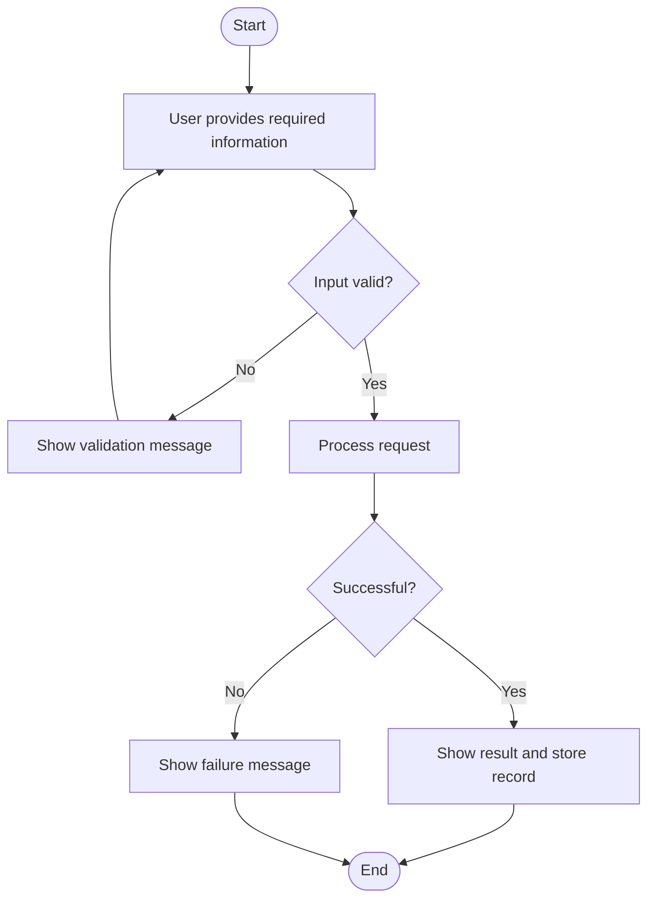
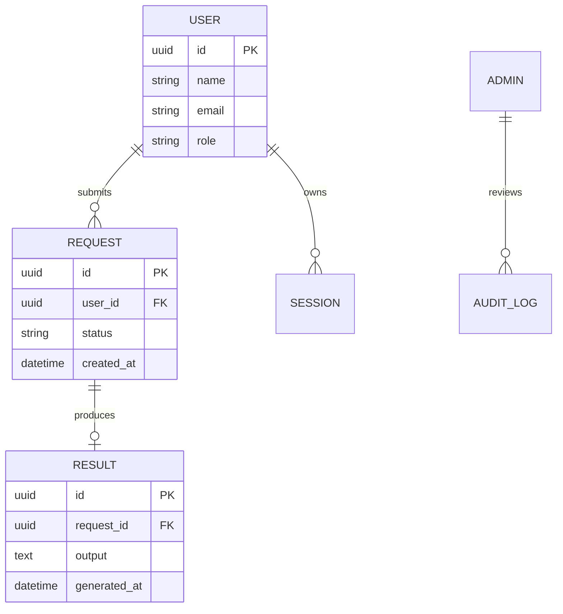
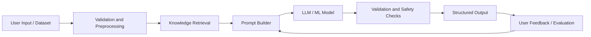

# Diagram Templates

Use Mermaid blocks unless the user requests another diagram format.

## Use Case Diagram

Mermaid does not have native UML use-case syntax in all renderers. Use a readable flowchart approximation:

Use 2-4 actors and 4-8 use cases for concise SRS documents.

## Use Case Description Table

| Use Case ID | Use Case | Primary Actor | Preconditions | Main Flow | Outcome |
| --- | --- | --- | --- | --- | --- |
| UC-1 | Register / Sign In | User | User has access to the application | User submits credentials; system validates; session starts | User is authenticated |

## Activity Diagram

## ER Diagram

## AI Pipeline Diagram

For non-RAG systems, remove `Retrieve`. For supervised ML systems, replace `Prompt Builder` and `LLM / ML Model` with `Feature Extraction`, `Training`, and `Inference`.
