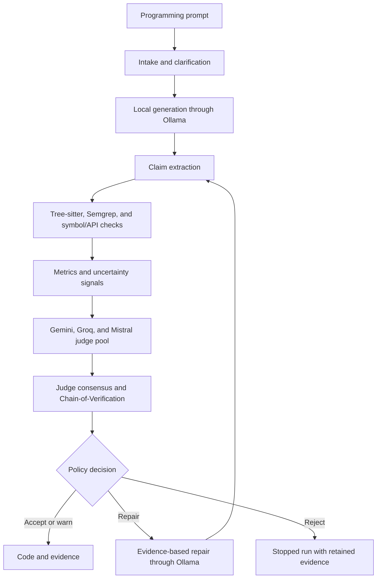

<div align="center">

# DeHalu

**Generate code. Verify its claims. Repair with evidence.**

A research workspace for detecting and mitigating hallucinations in LLM-generated code through static analysis, a multi-provider judge pool, and Chain-of-Verification.


[Quick start](#quick-start) · [How it works](#how-it-works) · [Configuration](#configuration) · [Documentation](#documentation) · [Contributing](#contributing)

</div>

## Why DeHalu?

Generated code can look convincing while referencing nonexistent packages, inventing APIs, or making claims its implementation does not support. DeHalu turns a programming prompt into code and an inspectable record of the checks behind it.

It generates code locally through Ollama, extracts checkable claims, gathers static and semantic evidence, and decides whether to **accept, warn, repair, or reject** each attempt. Repairs receive the failed code and its evidence, then pass through verification again.

**Generated programs are never executed or installed during verification.** DeHalu is an academic prototype; its verdicts describe the available evidence and do not guarantee runtime correctness.

## Features

- **Streamed code generation** — watch code arrive alongside stage progress in a Next.js workspace.
- **Prompt clarification** — infer language, framework, and runtime requirements, with a bounded clarification round when needed.
- **Static verification** — combine Tree-sitter parsing, Semgrep rules, lexical symbol checks, and selected package/API catalogs.
- **Three semantic judges** — Gemini checks requirement alignment, Groq checks functional logic, and Mistral checks quality and safety.
- **Chain-of-Verification (CoVe)** — check extracted claims against evidence and retain supported, unsupported, and uncertain results.
- **Evidence-driven repairs** — retry within a configured budget and compare code and metrics across attempts.
- **Durable runs** — PostgreSQL-backed jobs, a separate worker, and replayable server-sent events preserve progress across browser reloads.
- **Inspectable results** — browse claims, findings, analyzer coverage, judge verdicts, metrics, and downloadable JSON evidence.

## Quick start

Start with deterministic demo mode to explore the workspace without Ollama or provider API keys. Static checks still run; simulated judge results do not establish semantic verification. For real generation and judging, follow [Live model setup](#live-model-setup).

### Prerequisites

- Python **3.11+**
- Node.js **20+** and npm
- Docker with the Compose plugin
- Git

The commands below use Bash. Run each numbered step from the repository root in a new terminal, unless indicated otherwise.

### 1. Clone and configure

```bash
git clone https://github.com/FarhanTausif/SPL-3.git
cd SPL-3
cp .env.example .env
```

In the root `.env`, change the existing demo-mode setting to:

```dotenv
DEHALU_ALLOW_FAKE_LLM=true
```

Start PostgreSQL and check that it is healthy before applying migrations:

```bash
docker compose up -d postgres
docker compose ps postgres
```

### 2. Install and start the API

```bash
cd backend
python3 -m venv .venv
source .venv/bin/activate
python -m pip install -e ".[test]"
alembic upgrade head
uvicorn dehalu.main:app --host 127.0.0.1 --port 8000 --reload
```

### 3. Start the worker

In a second terminal:

```bash
cd backend
source .venv/bin/activate
python -m dehalu.worker
```

The API queues requests; **the worker must be running to process them**.

### 4. Start the frontend

In a third terminal:

```bash
cd frontend
npm ci
npm run dev
```

| Service | Local address |
| --- | --- |
| Workspace | [localhost:3000](http://localhost:3000) |
| Interactive API docs | [localhost:8000/docs](http://localhost:8000/docs) |
| Health and provider status | [localhost:8000/api/health](http://localhost:8000/api/health) |
| PostgreSQL | `localhost:5433` |

Try **“Write a Python function that adds two numbers.”** Open the evidence view to inspect the attempt. Demo output uses deterministic fixtures rather than general-purpose generation, and health reports `degraded` without live model coverage.

## Live model setup

With Ollama installed and running locally, pull the model configured in `.env.example`:

```bash
ollama pull qwen2.5-coder:1.5b
```

Update your root `.env`:

```dotenv
DEHALU_ALLOW_FAKE_LLM=false
OLLAMA_BASE_URL=http://localhost:11434
OLLAMA_MODEL=qwen2.5-coder:1.5b
GEMINI_API_KEY=your-gemini-key
GROQ_API_KEY=your-groq-key
MISTRAL_API_KEY=your-mistral-key
```

Use `GEMINI_MODEL`, `GROQ_MODEL`, and `MISTRAL_MODEL` to select models available to your provider accounts. The checked-in values are configuration defaults; authenticated model access and quota must be verified for your accounts.

Restart **both the API and worker** after changing backend settings. Check configured provider catalogs from `backend/`:

```bash
source .venv/bin/activate
PYTHONPATH=src python scripts/provider_readiness.py
```

Live semantic judging sends the prompt, generated code, and verification context to the configured external providers. Missing keys, quota failures, and invalid responses remain explicit in the evidence and prevent unrestricted acceptance.

## How it works



Every completed attempt retains its source artifact, claims, static findings, analyzer coverage, metrics, judge results, CoVe results, and policy decision. Repairs repeat verification within the retry budget; repeated code also stops the repair loop.

| Decision | Meaning |
| --- | --- |
| **Accept** | Material claims are supported, configured checks completed, and all three judges pass. |
| **Warn** | No blocking contradiction was found, but uncertainty, limited coverage, or incomplete/disagreeing judges remain. |
| **Repair** | Blocking findings, unsupported claims, or majority semantic failure require another attempt, and repair budget remains. |
| **Reject** | Blocking evidence remains and no further repairs are allowed, or repeated code stops repair. |

### Language coverage

The adapter registry includes **Python, JavaScript, TypeScript, Java, Go, Rust, C, and C++**. Python has lexical scope checks and selected catalog API validation. Other languages have AST-based claims and partial symbol/API coverage; full type and build context is unavailable. Each attempt reports its actual analyzer coverage.

### Metrics

| Signal | Current implementation |
| --- | --- |
| **MiHN** | Number of unsupported claims. |
| **MaHR** | Fraction of all claims marked unsupported, uncertain, or not checked. |
| **TR-S** | Repetition score from duplicate lines and token blocks. |
| **Static severity** | Weighted static findings, normalized and capped at 1. |
| **Token entropy** | Estimated uncertainty from Ollama token probabilities, when available. |
| **Hallucination risk** | Weighted combination of MaHR, repetition, severity, and available entropy. |

Risk is a comparative score, not a calibrated error probability. Entropy is a lower-bound estimate over returned top-token probabilities and grouped remaining mass; unsupported measurements remain unavailable. See the [runbook](PROJECT_RUNBOOK.md#clarification-judge-coverage-and-entropy) for measurement details.

## Configuration

Use [`.env.example`](.env.example) as the starting point. Backend precedence is **process environment → `backend/.env` → root `.env`**.

| Variable | Purpose |
| --- | --- |
| `DATABASE_URL` | SQLAlchemy connection URL; the local Compose database uses port `5433`. |
| `DEHALU_ALLOW_FAKE_LLM` | Enable deterministic generation and simulated judge results; defaults to `false`. |
| `OLLAMA_BASE_URL`, `OLLAMA_MODEL` | Local generation and repair service/model. |
| `GEMINI_API_KEY`, `GROQ_API_KEY`, `MISTRAL_API_KEY` | Credentials for live semantic judges. |
| `GEMINI_MODEL`, `GROQ_MODEL`, `MISTRAL_MODEL` | Provider-specific judge model identifiers. |
| `DEHALU_MAX_RETRY` | Repair budget; `3` allows the initial attempt plus up to three repairs. |
| `DEHALU_PACKAGE_LOOKUPS` | Enable cached PyPI/npm/crates metadata requests; defaults to `false` for local catalogs only. |
| `DEHALU_WORKER_CONCURRENCY` | Concurrent worker jobs; defaults to `2`. |
| `DEHALU_WORKER_LEASE_SECONDS` | Worker lease duration; defaults to `120`. |
| `DEHALU_PROVIDER_RETRIES` | Provider request retry setting; defaults to `2`. |
| `DEHALU_CORS_ORIGINS`, `DEHALU_CORS_ORIGIN_REGEX` | Allowed frontend origins. |
| `NEXT_PUBLIC_API_BASE_URL` | Browser-facing API URL; the frontend falls back to `http://localhost:8000`. |

For a custom frontend API address, set `NEXT_PUBLIC_API_BASE_URL` in **`frontend/.env.local`** and restart the frontend. Next.js does not load the repository-root `.env` automatically; rebuild a production frontend after changing this public variable.

Keep credentials in local environment files. The Compose credentials are development defaults.

## API

Create a run:

```bash
curl -X POST http://localhost:8000/api/runs \
  -H 'Content-Type: application/json' \
  -d '{"prompt":"Write a Python function that adds two numbers.","language_hint":"python","max_retry":3}'
```

The API returns **HTTP 202** with a run summary. Use its `id` to follow events or retrieve evidence:

```bash
curl -N http://localhost:8000/api/runs/RUN_ID/events
curl http://localhost:8000/api/runs/RUN_ID/evidence
```

| Method | Endpoint | Purpose |
| --- | --- | --- |
| `GET` | `/api/health` | Database, Ollama, configured judges, and capabilities. |
| `POST` | `/api/runs` | Queue a new run. |
| `GET` | `/api/runs` | List run history with `limit` and `offset`. |
| `GET` | `/api/runs/{id}` | Retrieve a run summary. |
| `GET` | `/api/runs/{id}/events` | Stream/replay events with `after` or `Last-Event-ID`. |
| `GET` | `/api/runs/{id}/evidence` | Retrieve attempt evidence. |
| `GET` | `/api/runs/{id}/export` | Download evidence as JSON. |
| `POST` | `/api/runs/{id}/clarification` | Submit clarification answers or skip clarification. |
| `POST` | `/api/runs/{id}/cancel` | Cancel a run. |

Full request and response schemas are available in the local [OpenAPI docs](http://localhost:8000/docs). Closing the browser leaves a background run active; cancellation is explicit.

## Development

### Repository layout

```text
backend/
  src/dehalu/
    api/             FastAPI routes and event streaming
    core/            Application settings
    domain/          Typed contracts and evidence models
    providers/       Ollama, semantic judges, uncertainty signals
    services/        Run orchestration and repair pipeline
    state/           Persistence and durable job lifecycle
    verification/    Claims, analyzers, metrics, CoVe, policy
    worker.py        Background worker entry point
  alembic/           Database migrations
  scripts/           Contract generation and provider checks
  tests/             Unit and integration tests
frontend/
  app/               Next.js routes
  components/        Workspace UI and shared primitives
  lib/               API client and generated contracts
SRS/                 Requirements, design, and diagrams
Papers/              Research notes
PROJECT_RUNBOOK.md   Operational and demo guidance
```

### Checks

Backend, from `backend/` with the virtual environment active:

```bash
pytest
```

Frontend, from `frontend/`:

```bash
npm test
npm run lint
npx tsc --noEmit
npm run build
```

For browser checks, install Chromium once, then run the suite:

```bash
npx playwright install chromium
npm run test:browser
```

Browser tests use mocked API/SSE responses and port `3001`. See the [runbook](PROJECT_RUNBOOK.md#frontend-workspace-checks) for artifacts and browser configuration.

After changing backend API/domain schemas, regenerate frontend contracts from the repository root:

```bash
PYTHONPATH=backend/src backend/.venv/bin/python backend/scripts/generate_contracts.py
```

## Troubleshooting

| Symptom | What to check |
| --- | --- |
| A run stays queued | Start `python -m dehalu.worker` using the same database configuration as the API. |
| Database connection or missing-table errors | Confirm PostgreSQL is healthy on port `5433`, check `DATABASE_URL`, and run `alembic upgrade head`. |
| Ollama is unavailable | Confirm the service is running and the exact `OLLAMA_MODEL` is pulled; use demo mode for fixture generation. |
| Judges show unavailable or failed | Check keys, model access, and quota; restart the API and worker after settings changes. |
| Frontend cannot reach the API | Check `frontend/.env.local`, the API process, and allowed CORS origins. |
| Health reports `degraded` in demo mode | Expected: demo mode does not establish live Ollama or semantic judge coverage. |

## Documentation

- [Project runbook](PROJECT_RUNBOOK.md) — startup, demo prompts, worker behavior, provider checks, and measurement details.
- [Software Requirements Specification](SRS/DeHalu_SRS.md) — requirements and project scope.
- [High-level design](SRS/High-Level-Design.md) — detection and mitigation pipeline.
- [Architecture diagrams](SRS/diagrams/README.md) — system architecture, verification flow, and editable Draw.io sources.
- [Project proposal](SRS/DeHalu_Project_Proposal.md) — motivation and academic context.
- [Research notes](Papers/) — background material on hallucination detection and LLM evaluation.

## Contributing

Open an [issue](https://github.com/FarhanTausif/SPL-3/issues) to discuss a bug or substantial feature. For changes, follow the [repository guidelines](AGENTS.md), keep commits focused, and use Conventional Commit prefixes such as `feat:`, `fix:`, or `docs:`.

Pull requests should describe the user-visible behavior, list verification commands, call out configuration or migration changes, and include screenshots for UI changes. Add focused coverage for changes to API contracts, streaming, parsing, or verification policy. Keep API keys, database dumps, virtual environments, and build artifacts out of commits.

## License

This repository does not currently include a project-level license. Third-party dependencies and bundled assets retain their respective licenses.
