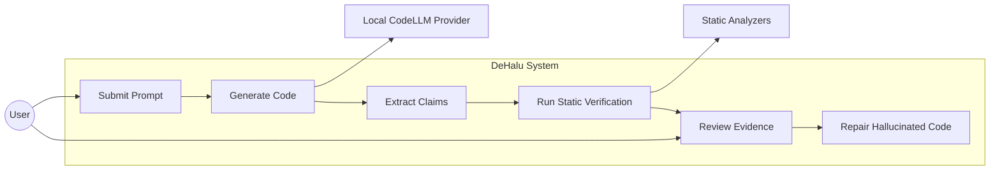
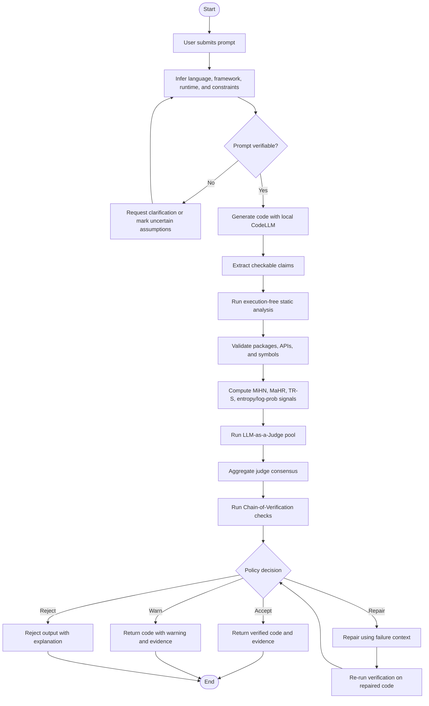
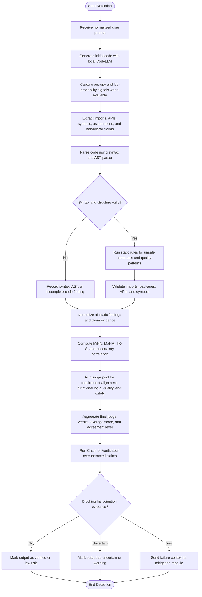
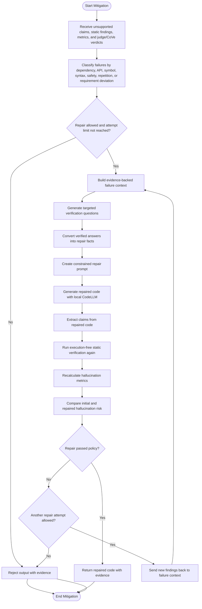
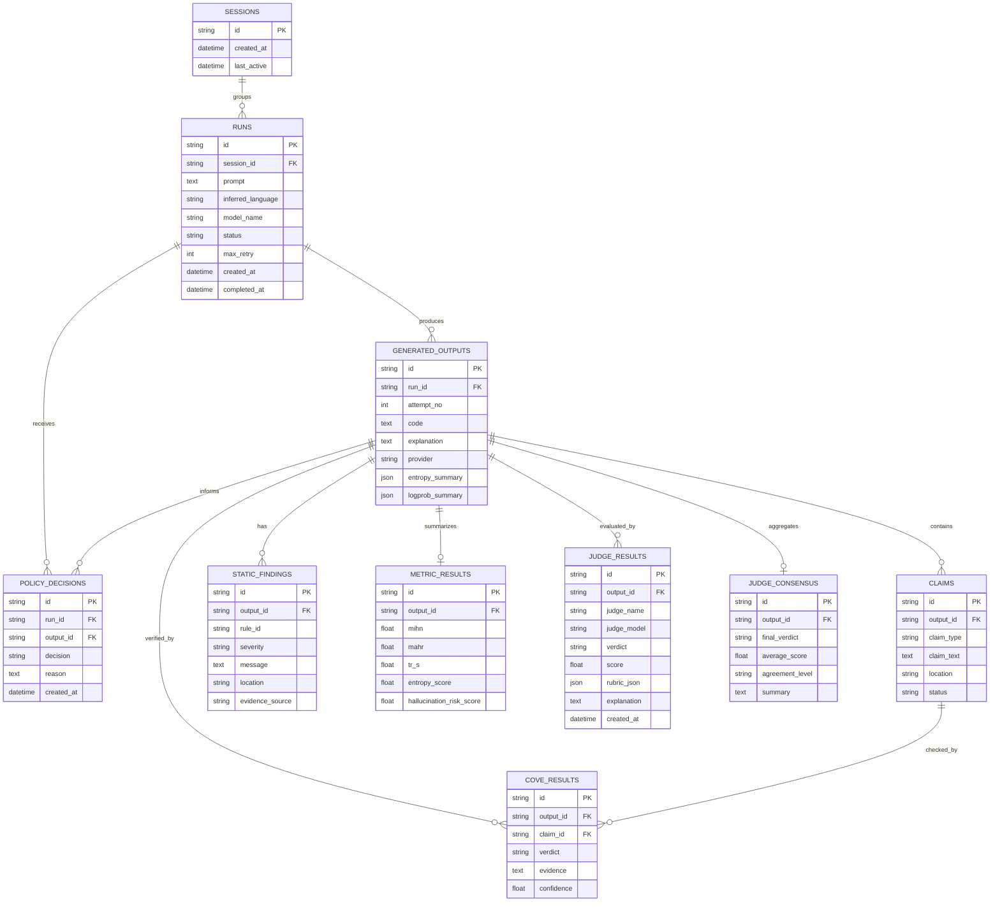
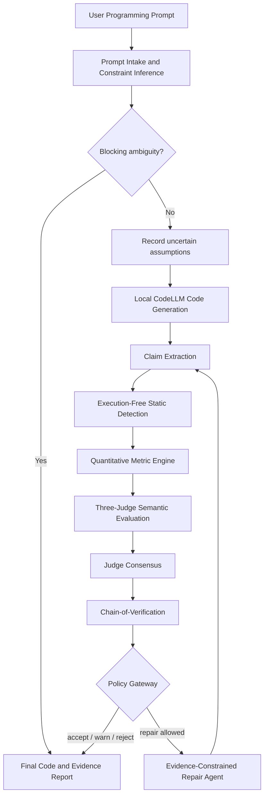

# Software Requirements Specification

## DeHalu: Agentic Hallucination Detection and Mitigation for Local CodeLLMs

### 1. Project Overview

#### 1.1 Project Title

DeHalu: Agentic Hallucination Detection and Mitigation for Local CodeLLMs

#### 1.2 Problem Statement

Students and developers increasingly use local code-generating large language models because they are free, private, and available without subscription limits. However, local CodeLLMs may generate code that appears confident and syntactically plausible while containing hallucinated dependencies, fake APIs, invalid symbols, missing requirements, unsafe constructs, or logically incorrect behavior. When such code is accepted without verification, it can fail during integration, mislead the user, or introduce security and maintainability risks.

The problem is not only that generated code may contain ordinary programming errors. In hallucination cases, the model may invent facts about packages, APIs, language behavior, framework functions, or the user's intended requirements. These errors are difficult for users to detect because the response often includes fluent explanations and confident claims. Typical prompt-only solutions are insufficient because they depend on the same model's self-assessment, confidence scores alone do not prove correctness, and dynamic execution can be costly or unsafe for arbitrary generated code.

DeHalu addresses this problem by acting as a verification gateway between the user and a local CodeLLM. The system generates code, extracts checkable claims from the generated output, validates the claims using execution-free static analysis and tool-backed evidence, computes hallucination metrics, and either accepts, rejects, or repairs the output through a controlled mitigation loop.

#### 1.3 Objectives

- Detect code hallucinations before generated code is trusted by the user.
- Focus the committed verification scope on execution-free static analysis and tool-backed validation.
- Identify hallucination-related error types such as fake imports, invalid APIs, undefined symbols, requirement deviation, and unsafe structural patterns.
- Use a structured LLM-as-a-Judge pool and Chain-of-Verification checks as supporting verification signals, not as standalone proof.
- Provide transparent quantitative metrics and evidence for each accept, reject, or repair decision.
- Apply parameter-free mitigation through prompt structure, verification questions, and repair prompts instead of model fine-tuning.

#### 1.4 Scope

In scope:

- Natural-language prompt intake for code generation tasks.
- Automatic inference of target language, framework, runtime, and constraints when possible.
- Code generation using a local CodeLLM.
- Claim extraction from generated code and explanations.
- Execution-free syntax, AST, import, symbol, and package/API validation.
- Quantitative hallucination metrics including MiHN, MaHR, TR-S, entropy, and log-probability signals where available.
- LLM-as-a-Judge pool evaluation with strict rubrics for requirement alignment, functional logic, code quality, and safety.
- Chain-of-Verification based claim checking against static-analysis evidence.
- Policy-based accept, reject, warn, or repair decisions.
- Evidence reporting through backend records and a frontend monitoring interface.

Out of scope:

- Arbitrary dynamic execution of generated code as a required verification method.
- Training or fine-tuning a new CodeLLM.
- Full repository-level RAG or large external documentation retrieval as a required component.
- Complete vulnerability assessment equivalent to a dedicated security audit.
- Guaranteed proof of semantic correctness for every possible program.

#### 1.5 Deliverables

- A working web application that accepts natural-language programming prompts, generates code through a local CodeLLM, and returns verified, warned, rejected, or repaired code with evidence.
- A backend service exposing the prompt intake, code generation, claim extraction, static-analysis verification, metric calculation, judge evaluation, Chain-of-Verification, policy decision, and repair workflow APIs consumed by the frontend.
- An execution-free static verification pipeline that detects hallucination-raised errors such as fake imports, invalid APIs, undefined symbols, syntax or AST errors, unsupported assumptions, unsafe constructs, and requirement deviations.
- A live monitoring interface that visualizes each verification stage, including generated code, extracted claims, analyzer findings, hallucination metrics, judge and CoVe verdicts, policy decisions, and repair attempts.
- A persisted run-history and evidence store that supports later review by the student developer, supervisor, or evaluator.
- An academic SRS, design documentation, and evaluation report describing the system requirements, architecture, hallucination error taxonomy, static-analysis scope, and validation results.

### 2. Requirements Analysis

#### 2.1 Stakeholders

| Stakeholder | Role / Interest |
| --- | --- |
| Student Developer | Uses the system to generate safer code from local CodeLLMs. |
| System Maintainer | Maintains backend pipeline, model adapters, static analyzers, and frontend reporting. |
| Local CodeLLM Provider | Supplies generated code through a local inference runtime such as Ollama. |

#### 2.2 Hallucination Error Taxonomy

| Paper Category | Error Type | Primary Detection Responsibility |
| --- | --- | --- |
| Syntactic Hallucination | Syntax Violation | Tree-sitter or language-specific AST parser detects invalid syntax and malformed structures. |
| Syntactic Hallucination | Incomplete Code Generation | AST parsing and static heuristics detect incomplete blocks, missing definitions, and unfinished code. |
| Runtime Execution Hallucination | API Knowledge Conflict | Symbol indexer and package/API validation detect invented or incompatible APIs without executing code. |
| Runtime Execution Hallucination | Invalid Reference Errors | Symbol indexer and static reference analysis detect unresolved imports, undefined symbols, and invalid references. |
| Functional Correctness Hallucination | Incorrect Logical Flow | LLM-as-a-Judge pool evaluates semantic correctness using a strict functional logic rubric. |
| Functional Correctness Hallucination | Requirement Deviation | LLM-as-a-Judge pool compares prompt requirements, extracted behavioral claims, and generated code. |
| Code Quality Hallucination | Resource Mishandling | Semgrep/static rules detect known resource-misuse patterns; judge pool reviews broader semantic risks. |
| Code Quality Hallucination | Security Vulnerability | Semgrep/static rules detect known unsafe patterns; judge pool reviews remaining security concerns. |
| Code Quality Hallucination | Code Smell | Static rules and judge-pool review detect repeated, unclear, or low-quality generated structures. |

DeHalu addresses all four hallucination categories in the taxonomy. Its strongest deterministic coverage is for syntax, incomplete code, API conflicts, and invalid references. Functional correctness and broader code quality findings are handled as semantic evidence through the judge pool and policy layer rather than as absolute proof.

#### 2.3 Hallucination-Raised Error Mapping

| Hallucinated Claim or Behavior | Error Raised in Generated Code | Static Evidence Used by DeHalu | Policy Impact |
| --- | --- | --- | --- |
| Invented package or module exists | Missing dependency or unresolved import | Import resolver, package index lookup, AST import node | Repair or reject when the dependency is unsupported |
| Real package has an invented API | Invalid function, method, class, or parameter usage | Symbol table, framework metadata, API index evidence | Repair when a known replacement exists; otherwise warn or reject |
| Helper function or variable is assumed to exist | Undefined symbol or incomplete implementation | AST symbol collection and reference analysis | Repair or reject depending on severity |
| Generated code is structurally malformed | Syntax or parser error | Language parser error, malformed AST, incomplete block detection | Reject or repair before any user-facing acceptance |
| Code solves a different task than requested | Requirement deviation | Judge rubric, extracted behavioral claims, prompt-to-code checklist | Warn, repair, or reject based on missing requirement severity |
| Model repeats imports, blocks, or logic | Degenerated or repetitive output | TR-S score and repeated AST/text pattern detection | Warn or repair when repetition harms correctness |
| Risky operation is introduced without request | Unsafe construct generation | SAST rule, banned-call list, static sink/source pattern | Reject or repair because the risk is not user-authorized |
| Model assumes a version, framework, or input property | Unsupported environment assumption | Inference uncertainty flag, dependency metadata, requirement comparison | Warn or repair by removing the assumption |

#### 2.4 Why Typical Solutions Are Insufficient

| Typical Solution | Limitation for Hallucination Errors |
| --- | --- |
| Asking the same model to self-check | The model may repeat the same invented fact with confidence and fail to challenge its own assumptions. |
| Relying on natural-language confidence | Confident wording does not correlate reliably with real API existence, requirement satisfaction, or code validity. |
| Simple linting only | Linters can detect some syntax and style issues but may miss fake package claims, invalid API semantics, and requirement deviations. |
| Dynamic execution as the main method | Executing arbitrary generated code introduces safety risk, environment overhead, and incomplete coverage for code paths not exercised. |
| Fine-tuning a larger model | Fine-tuning requires compute, data, and maintenance effort that are not practical for the project's student-budget local-LLM target. |
| RAG-only validation | Retrieval helps when documentation is available, but it does not by itself enforce deterministic claim extraction, policy decisions, or repair verification. |

The proposed system therefore treats static analysis and tool-backed claim validation as the primary evidence layer. LLM-based judging and Chain-of-Verification are used to organize and interpret evidence, but they shall not replace deterministic static findings.

#### 2.5 Functional Requirements

##### Prompt Intake and Inference

- FR-1.1: Users shall submit a natural-language programming prompt.
- FR-1.2: The system shall infer the likely target language from the prompt when the user does not state it.
- FR-1.3: The system shall infer framework, runtime, and constraint assumptions when they are clearly implied.
- FR-1.4: The system shall mark uncertain inferred assumptions as evidence rather than treating them as confirmed facts.
- FR-1.5: The system shall reject or request clarification for prompts that are too ambiguous for meaningful verification.

##### Code Generation

- FR-2.1: The system shall send the normalized prompt to a local CodeLLM.
- FR-2.2: The system shall store the generated code, model identifier, prompt metadata, and generation timestamp for each run.
- FR-2.3: The system shall capture token log-probability and predictive entropy signals when the selected model provider exposes them.
- FR-2.4: The system shall separate generated code from explanatory text when possible.

##### Claim Extraction

- FR-3.1: The system shall extract imports, packages, APIs, symbols, functions, classes, and runtime assumptions from generated code.
- FR-3.2: The system shall extract behavioral claims from generated explanations when they are present.
- FR-3.3: The system shall assign each claim a stable claim identifier.
- FR-3.4: The system shall classify each claim by type, including dependency, API, symbol, behavior, safety, or assumption.

##### Execution-Free Static Analysis

- FR-4.1: The system shall parse generated code without executing it.
- FR-4.2: The system shall detect syntax and AST structure errors.
- FR-4.3: The system shall detect undefined symbols where language adapters support symbol analysis.
- FR-4.4: The system shall detect unsupported imports and suspicious dependency references.
- FR-4.5: The system shall apply static security and quality rules to identify unsafe generated constructs.
- FR-4.6: The system shall report static-analysis findings with severity, location, rule identifier, and explanation where available.

##### Tool-Backed Package and API Validation

- FR-5.1: The system shall validate referenced packages against configured package or symbol indexes when available.
- FR-5.2: The system shall validate referenced APIs against language or framework metadata when available.
- FR-5.3: The system shall mark unverifiable package or API claims as uncertain instead of silently accepting them.
- FR-5.4: The system shall use tool-backed evidence as a primary signal for dependency and API hallucination decisions.

##### Quantitative Metric Engine

- FR-6.1: The system shall compute Micro Hallucination Number for invalid or unsupported micro-level code claims.
- FR-6.2: The system shall compute Macro Hallucination Rate for the proportion of hallucinated claims in an output.
- FR-6.3: The system shall compute TR-S or an equivalent structural repetition score for repeated generated structures.
- FR-6.4: The system shall correlate static invalid-reference evidence with entropy or log-probability spikes when available.
- FR-6.5: The system shall use metrics as evidence signals for severity ranking, policy decisions, and before/after repair comparison.
- FR-6.6: The system shall expose metrics as part of the final verification report.

##### LLM-as-a-Judge Pool Verification

- FR-7.1: The system shall evaluate generated code using a pool of structured LLM-as-a-Judge evaluators.
- FR-7.2: The judge pool shall include rubric coverage for requirement alignment, functional logic, code quality, safety, unsupported assumptions, dependency plausibility, and API validity.
- FR-7.3: Each judge shall produce structured scores and findings instead of only free-form text.
- FR-7.4: The system shall aggregate judge outputs into a consensus verdict with average score and agreement level.
- FR-7.5: Judge findings shall not override deterministic static-analysis failures.

##### Chain-of-Verification

- FR-8.1: The system shall convert extracted claims into targeted verification questions.
- FR-8.2: The system shall answer verification questions using static-analysis findings and tool-backed evidence.
- FR-8.3: The system shall classify each checked claim as supported, unsupported, or uncertain.
- FR-8.4: The system shall include unsupported and uncertain claims in the policy decision.

##### Policy Decision and Mitigation

- FR-9.1: The system shall combine static findings, metric scores, judge consensus, and CoVe results into a deterministic policy decision.
- FR-9.2: The system shall support at least four policy outcomes: accept, warn, repair, and reject.
- FR-9.3: The system shall trigger repair when blocking hallucination evidence is detected and repair is allowed.
- FR-9.4: The repair agent shall receive the failed code and evidence-backed failure context.
- FR-9.5: The repaired code shall pass through the verification pipeline again before being returned.
- FR-9.6: The system shall limit repair attempts to prevent unbounded loops.

##### Evidence Reporting and Monitoring

- FR-10.1: The system shall show the final generated or repaired code to the user.
- FR-10.2: The system shall show the policy decision and hallucination risk evidence.
- FR-10.3: The system shall display stage-level results for generation, claim extraction, static analysis, metrics, judge verification, CoVe, policy, and repair.
- FR-10.4: The system shall persist run history and evidence for later review.
- FR-10.5: The frontend shall provide a live or near-real-time view of the verification workflow when backend events are available.

#### 2.6 Non-Functional Requirements

| ID | Category | Requirement |
| --- | --- | --- |
| NFR-1 | Security | The system shall not execute arbitrary generated code as part of the committed verification scope. |
| NFR-2 | Privacy | The system shall support local CodeLLM generation so user prompts and code can remain on the user's machine when configured locally. |
| NFR-3 | Reliability | The system shall fail closed by warning or rejecting output when blocking verification stages fail or evidence is insufficient. |
| NFR-4 | Explainability | The system shall provide evidence for each accept, warn, repair, or reject decision. |
| NFR-5 | Maintainability | Language-specific parsing and validation logic shall be isolated behind language adapters. |
| NFR-6 | Extensibility | The system shall allow additional analyzers, package registries, model providers, and judge rubrics to be added without rewriting the whole pipeline. |
| NFR-7 | Performance | The system shall complete static verification for typical single-file generated code within an interactive response window suitable for student use. |
| NFR-8 | Compatibility | The frontend shall support modern desktop browsers and responsive layouts for common laptop screen sizes. |
| NFR-9 | Auditability | The system shall persist prompt, model, generated output, extracted claims, findings, metrics, and policy decisions for each run. |
| NFR-10 | Usability | The system shall present verification results in a form understandable to users who may not know the internal analyzer tools. |

### 3. System Modeling

#### 3.1 System-Level Use Case Diagram



#### 3.2 Use Case Descriptions

| Use Case ID | Use Case | Primary Actor | Preconditions | Main Flow | Outcome |
| --- | --- | --- | --- | --- | --- |
| UC-1 | Submit Prompt | Student Developer | User has access to the application | User enters a programming request; system normalizes and infers missing constraints | A normalized generation request is created |
| UC-2 | Generate Code | Student Developer | A normalized prompt exists | System sends prompt to local CodeLLM; model returns code and metadata | Initial code draft is available |
| UC-3 | Extract Claims | System | Generated code is available | System extracts imports, APIs, symbols, assumptions, and behavior claims | Structured claim list is produced |
| UC-4 | Run Static Verification | System | Claims and code are available | System parses code and validates claims using static analyzers and tool evidence | Static findings and validation results are produced |
| UC-5 | Review Evidence | Student Developer | Verification is complete | System shows metrics, findings, policy decision, and evidence | User understands why output was accepted, warned, repaired, or rejected |
| UC-6 | Repair Hallucinated Code | System | Policy decision allows repair | Repair agent receives failed code and evidence; repaired code is reverified | Repaired code is accepted, warned, or rejected |

#### 3.3 System-Level Activity Diagram



#### 3.4 Detection Use Case Diagram

The detection use case diagram breaks the detection module into the main user-visible and system-internal use cases required to identify hallucination evidence before mitigation starts.

```mermaid
%%{init: {"theme": "base", "themeVariables": {"background": "#000000", "primaryTextColor": "#111111", "lineColor": "#111111", "fontFamily": "Arial"}}}%%
flowchart LR
    User((User))

    subgraph IntakeColumn[" "]
        direction TB
        Submit([Submit Prompt])
        Generate([Generate Code])
        Extract([Extract Claims])

        Submit --> Generate
        Generate --> Extract
    end

    subgraph StaticDetectionColumn[" "]
        direction TB
        Parse([Parse Syntax and AST])
        StaticRules([Run Static Rules])
        SymbolCheck([Validate Packages and APIs])

        Parse --> StaticRules
        StaticRules --> SymbolCheck
    end

    subgraph SemanticDetectionColumn[" "]
        direction TB
        Metrics([Calculate Hallucination Metrics])
        Judge([Evaluate Semantic Correctness])
        CoVe([Run Chain-of-Verification])
        Verdict([Make Detection Verdict])
        Review([Review Evidence])

        Metrics --> Judge
        Judge --> CoVe
        CoVe --> Verdict
        Verdict --> Review
    end

    subgraph DetectionProviders[" "]
        direction TB
        LocalModel(Local CodeLLM<br/>Provider)
        StaticAnalyzers(Static Analyzers)
        SymbolIndex(Package / Symbol<br/>Index)
        JudgePool(Judge Pool)

        LocalModel ~~~ StaticAnalyzers
        StaticAnalyzers ~~~ SymbolIndex
        SymbolIndex ~~~ JudgePool
    end

    User -.-> Submit
    User -.-> Review
    Extract --> Parse
    SymbolCheck --> Metrics
    Generate --- LocalModel
    Parse --- StaticAnalyzers
    StaticRules --- StaticAnalyzers
    SymbolCheck --- SymbolIndex
    Judge --- JudgePool

    classDef actor fill:#dbeafe,stroke:#5f83b5,stroke-width:2px,color:#111111;
    classDef usecase fill:#fff1c7,stroke:#b08a00,stroke-width:2px,color:#111111;
    classDef external fill:#d8e7fb,stroke:#5f83b5,stroke-width:2px,color:#111111;

    class User actor;
    class Submit,Generate,Extract,Parse,StaticRules,SymbolCheck,Metrics,Judge,CoVe,Verdict,Review usecase;
    class LocalModel,StaticAnalyzers,SymbolIndex,JudgePool external;
    style IntakeColumn fill:#000000,stroke:#000000,color:#000000;
    style StaticDetectionColumn fill:#000000,stroke:#000000,color:#000000;
    style SemanticDetectionColumn fill:#000000,stroke:#000000,color:#000000;
    style DetectionProviders fill:#000000,stroke:#000000,color:#000000;

    linkStyle default stroke:#111111,stroke-width:2px;
```



#### 3.5 Detection Activity Diagram

This activity diagram expands the static detection path into parser, SAST, symbol-validation, metric, judge, and policy-verdict stages.



#### 3.6 Mitigation Use Case Diagram

The mitigation use case diagram breaks the repair loop into evidence preparation, constrained repair, re-verification, retry control, and result-return use cases.

```mermaid
%%{init: {"theme": "base", "themeVariables": {"background": "#000000", "primaryTextColor": "#111111", "lineColor": "#111111", "fontFamily": "Arial"}}}%%
flowchart LR
    User((User))

    subgraph EvidencePreparationColumn[" "]
        direction TB
        Receive([Receive Detection Findings])
        Build([Build Failure Context])
        Questions([Generate Verification Questions])
        Facts([Convert Findings to CoVe Facts])

        Receive --> Build
        Build --> Questions
        Questions --> Facts
    end

    subgraph RepairColumn[" "]
        direction TB
        RepairPrompt([Create Repair Prompt])
        Repair([Repair Hallucinated Code])
        Reverify([Re-run Static Verification])

        RepairPrompt --> Repair
        Repair --> Reverify
    end

    subgraph PolicyColumn[" "]
        direction TB
        Metrics([Recalculate Metrics])
        Compare([Compare Attempts])
        Policy([Apply Repair Policy])
        Retry([Control Repair Retry])
        Return([Return Repaired or Rejected Result])

        Metrics --> Compare
        Compare --> Policy
        Policy --> Retry
        Retry --> Return
    end

    subgraph MitigationProviders[" "]
        direction TB
        LocalModel(Local CodeLLM<br/>Provider)
        StaticAnalyzers(Static Analyzers)
        JudgeEvidence(Judge / CoVe<br/>Evidence)

        LocalModel ~~~ StaticAnalyzers
        StaticAnalyzers ~~~ JudgeEvidence
    end

    User -.-> Receive
    Return -.-> User
    Facts --> RepairPrompt
    Reverify --> Metrics
    Retry -.-> Build
    Repair --- LocalModel
    Reverify --- StaticAnalyzers
    Facts --- JudgeEvidence

    classDef actor fill:#dbeafe,stroke:#5f83b5,stroke-width:2px,color:#111111;
    classDef usecase fill:#fff1c7,stroke:#b08a00,stroke-width:2px,color:#111111;
    classDef external fill:#d8e7fb,stroke:#5f83b5,stroke-width:2px,color:#111111;

    class User actor;
    class Receive,Build,Questions,Facts,RepairPrompt,Repair,Reverify,Metrics,Compare,Policy,Retry,Return usecase;
    class LocalModel,StaticAnalyzers,JudgeEvidence external;
    style EvidencePreparationColumn fill:#000000,stroke:#000000,color:#000000;
    style RepairColumn fill:#000000,stroke:#000000,color:#000000;
    style PolicyColumn fill:#000000,stroke:#000000,color:#000000;
    style MitigationProviders fill:#000000,stroke:#000000,color:#000000;

    linkStyle default stroke:#111111,stroke-width:2px;
```



#### 3.7 Mitigation Activity Diagram

This activity diagram expands the repair loop. Repaired code is not returned directly; it must pass through static verification again before acceptance.



### 4. Data and Information Modeling

#### 4.1 Database Schema

| Table | Key Fields |
| --- | --- |
| sessions | id (PK), created_at, last_active |
| runs | id (PK), session_id (FK, nullable), prompt, inferred_language, model_name, status, max_retry, created_at, completed_at |
| generated_outputs | id (PK), run_id (FK), attempt_no, code, explanation, provider, entropy_summary, logprob_summary |
| claims | id (PK), output_id (FK), claim_type, claim_text, location, status |
| static_findings | id (PK), output_id (FK), rule_id, severity, message, location, evidence_source |
| metric_results | id (PK), output_id (FK), mihn, mahr, tr_s, entropy_score, hallucination_risk_score |
| judge_results | id (PK), output_id (FK), judge_name, judge_model, verdict, score, rubric_json, explanation, created_at |
| judge_consensus | id (PK), output_id (FK), final_verdict, average_score, agreement_level, summary |
| cove_results | id (PK), output_id (FK), claim_id (FK), verdict, evidence, confidence |
| policy_decisions | id (PK), run_id (FK), output_id (FK), decision, reason, created_at |

Note: Field names are proposed for SRS modeling. The implementation may use equivalent names while preserving the same information responsibilities.

#### 4.2 ER Diagram

The ER diagram models the main persistence entities for prompt submissions, generated outputs, extracted claims, static-analysis evidence, hallucination metrics, judge and CoVe results, and final policy decisions.



#### 4.3 Dataset and Evidence Sources

| Dataset / Source | Data Type | Purpose | Preprocessing | Privacy / Risk |
| --- | --- | --- | --- | --- |
| User prompts | Natural language text | Define programming task and constraints | Normalize language, framework, runtime, and ambiguity | May contain private code or requirements; store minimally |
| Generated code | Source code text | Subject of hallucination detection | Split code from explanation; parse by language | May contain sensitive logic if user provided context |
| Static analyzer output | Structured findings | Detect syntax, symbol, dependency, and safety issues | Normalize severity, rule ID, message, and location | Low privacy risk but linked to code |
| Package/API index evidence | Structured lookup results | Validate whether packages and APIs exist | Normalize package, symbol, version, and status | External lookup may reveal dependency names if online lookup is used |
| Judge and CoVe outputs | Structured JSON verdicts | Evaluate requirement alignment and claim support | Validate schema and normalize scores | May repeat code or prompt content; store with access control |

### 5. AI Engineering

#### 5.1 AI Pipeline



The AI pipeline is designed as an evidence-first verification gateway. The local CodeLLM is used for generation and repair, while deterministic static analyzers and symbol validators provide primary evidence for syntax, dependency, API, reference, safety, and code-quality findings. LLM judges provide semantic review for requirement alignment, functional logic, unsupported assumptions, and quality/safety interpretation. The policy gateway combines all evidence and controls whether code is accepted, warned, rejected, or repaired.

#### 5.2 Models and AI Components

| Component | Model / Tool Choice | Responsibility |
| --- | --- | --- |
| Prompt Intake Agent | Structured LLM prompt or deterministic parser with LLM fallback | Infer language, framework, runtime, libraries, task requirements, blocking ambiguities, and uncertain assumptions. |
| Code Generator | Local CodeLLM through Ollama or equivalent local runtime | Produce initial code from the normalized programming task while declaring assumptions and dependencies. |
| Static Parser | Tree-sitter or language-specific AST parser | Detect syntax violations, malformed structures, incomplete code blocks, and parse-level code smells without execution. |
| SAST Analyzer | Semgrep or equivalent static rule engine | Detect unsafe operations, resource mishandling, security patterns, and maintainability smells. |
| Symbol/API Validator | Language-specific symbol indexer, package metadata, framework metadata, and generic fallback | Detect fake imports, unresolved symbols, invented APIs, invalid references, and unverifiable dependency claims. |
| Metric Engine | Deterministic metric calculator | Compute MiHN, MaHR, TR-S, entropy/log-prob uncertainty score when available, static severity score, and hallucination risk score. |
| Judge Pool | Gemini, Groq, and Mistral or equivalent independent judge models | Each judge evaluates the same rubric: requirement alignment, functional logic, quality/safety, dependency/API plausibility, unsupported assumptions, and hallucination risk. |
| Consensus Aggregator | Deterministic aggregation policy | Combine three judge outputs into final semantic verdict, average score, agreement level, and explanation. |
| CoVe Verifier | Claim-level verification prompt plus static/tool evidence | Convert extracted claims into verification questions and classify each claim as supported, unsupported, or uncertain. |
| Repair Agent | Local CodeLLM with constrained mitigation prompt | Repair only evidence-supported failures, avoid unsupported dependencies, preserve valid behavior, and return revised code for re-verification. |

#### 5.3 Prompt Engineering

All AI prompts shall use explicit role instructions, bounded inputs, structured output schemas, and evidence-grounding rules. The system shall validate model outputs against the expected schema before storing or using them. If a model response is malformed, the system shall retry with a schema-repair instruction or mark the result as uncertain.

##### 5.3.1 Prompt Intake and Constraint Inference

**System Prompt**

```text
You are DeHalu's prompt intake analyst. Extract only information supported by the user request.
Do not invent requirements, libraries, frameworks, runtime versions, files, APIs, or deployment assumptions.
Return valid JSON only.
```

**User Prompt Template**

```text
Analyze the programming request below.

USER_REQUEST:
{user_prompt}

Return JSON with:
{
  "language": "string|null",
  "framework": "string|null",
  "runtime": "string|null",
  "libraries": ["string"],
  "task_requirements": ["string"],
  "constraints": ["string"],
  "uncertain_assumptions": ["string"],
  "blocking_questions": ["string"],
  "needs_clarification": true|false
}

Rules:
- Use needs_clarification=true only when missing information blocks meaningful generation or verification.
- If a language, framework, runtime, or library is likely but not explicit, place it in uncertain_assumptions.
- Keep each blocking question specific and answerable.
- Do not convert assumptions into facts.
```

##### 5.3.2 Code Generation Prompt

**System Prompt**

```text
You are DeHalu's local CodeLLM generation agent. Generate implementation code that directly satisfies the normalized task.
Prefer standard library features when possible. Do not introduce obscure packages, fake dependencies, or APIs that are not necessary.
If an assumption is required, state it separately from the code. Return one fenced code block and a short JSON metadata block.
```

**User Prompt Template**

````text
NORMALIZED_TASK:
{task_requirements}

INFERRED_CONTEXT:
- language: {language}
- framework: {framework}
- runtime: {runtime}
- allowed_libraries: {libraries}
- constraints: {constraints}
- uncertain_assumptions: {uncertain_assumptions}

Generate code for the task.

Output format:
```{language}
<code>
```
{
  "assumptions": ["string"],
  "dependencies": ["string"],
  "entry_points": ["string"],
  "limitations": ["string"]
}

Generation rules:
- Do not claim that a dependency, API, symbol, or runtime feature exists unless it is standard or explicitly required.
- If a dependency is optional, mark it as optional in the metadata.
- Keep code complete enough for static parsing.
- Avoid unsafe file, shell, network, credential, or destructive operations unless explicitly required by the task.
````

##### 5.3.3 Claim Extraction Prompt

Claim extraction may be performed by deterministic parsers, LLM extraction, or a hybrid method. The extraction prompt shall convert generated code and explanation into verifiable claims.

```text
You are DeHalu's claim extraction agent. Extract only concrete claims that can be checked without executing the code.
Return valid JSON only.

INPUT_CODE:
{generated_code}

INPUT_EXPLANATION:
{generation_explanation}

Return:
{
  "claims": [
    {
      "claim_type": "import|package|api|symbol|parameter|runtime|behavior|assumption|safety",
      "claim_text": "string",
      "location": "line number, symbol name, or explanation section",
      "check_method": "tree_sitter|semgrep|symbol_indexer|package_index|judge|cove",
      "initial_status": "not_checked"
    }
  ]
}

Rules:
- Split compound claims into smaller checkable claims.
- Include claims from comments and explanations only when they assert behavior, dependency, runtime, or safety facts.
- Do not decide whether a claim is true in this step.
```

##### 5.3.4 LLM-as-a-Judge Pool Prompt

Each judge receives the same task and rubric. The three judges shall be independent model calls so disagreement can be measured.

**System Prompt**

```text
You are an independent DeHalu judge for generated code. Evaluate the code using only the supplied prompt, code, extracted claims, static findings, symbol/API evidence, and metrics.
Do not execute code. Do not assume missing dependencies are valid. Deterministic static findings must be treated as stronger evidence than model intuition.
Return valid JSON only.
```

**User Prompt Template**

```text
USER_REQUEST:
{user_prompt}

GENERATED_CODE:
{generated_code}

EXTRACTED_CLAIMS:
{claims_json}

STATIC_AND_SYMBOL_FINDINGS:
{findings_json}

METRICS:
{metrics_json}

Evaluate these categories from 0.0 to 1.0:
1. requirement_alignment: Does the code implement the requested task?
2. functional_logic: Is the static logical flow plausible and complete?
3. quality_safety: Are resource use, security posture, and code quality acceptable?
4. dependency_api_plausibility: Are packages, imports, symbols, and APIs plausible based on evidence?
5. unsupported_assumptions: Does the code rely on unstated or unverifiable assumptions?
6. hallucination_risk: Overall risk that the code contains hallucinated functionality, APIs, symbols, or behavior.

Return:
{
  "verdict": "pass|warn|fail",
  "score": 0.0,
  "rubric_json": {
    "requirement_alignment": {"score": 0.0, "evidence": ["string"]},
    "functional_logic": {"score": 0.0, "evidence": ["string"]},
    "quality_safety": {"score": 0.0, "evidence": ["string"]},
    "dependency_api_plausibility": {"score": 0.0, "evidence": ["string"]},
    "unsupported_assumptions": {"score": 0.0, "evidence": ["string"]},
    "hallucination_risk": {"score": 0.0, "evidence": ["string"]}
  },
  "hallucination_types": ["syntax_violation|incomplete_code|api_knowledge_conflict|invalid_reference|incorrect_logical_flow|requirement_deviation|resource_mishandling|security_vulnerability|code_smell"],
  "blocking_issues": ["string"],
  "repair_suggestions": ["string"],
  "explanation": "short evidence-grounded explanation"
}

Scoring anchors:
- pass: no blocking static evidence and only minor or no uncertainty.
- warn: usable code with uncertain assumptions, non-blocking quality issues, or judge disagreement.
- fail: unsupported dependency/API/symbol, syntax failure, major requirement deviation, unsafe behavior, or severe logical flaw.
```

##### 5.3.5 Chain-of-Verification Prompt

The CoVe stage shall transform claims and findings into targeted verification questions. It shall not rely on the generator's confidence.

```text
You are DeHalu's Chain-of-Verification verifier. Verify each claim against supplied evidence.
Use supported only when evidence directly confirms the claim. Use unsupported when evidence contradicts it.
Use uncertain when evidence is incomplete.
Return valid JSON only.

CLAIMS:
{claims_json}

EVIDENCE:
{static_findings_json}
{symbol_api_evidence_json}
{metric_summary_json}
{judge_consensus_json}

Return:
{
  "cove_results": [
    {
      "claim_id": "string",
      "verification_question": "string",
      "verdict": "supported|unsupported|uncertain",
      "evidence": "string",
      "confidence": 0.0
    }
  ]
}

Rules:
- Do not mark a package, API, symbol, or behavior as supported without evidence.
- Static contradiction must produce unsupported.
- Missing evidence for an important claim must produce uncertain, not supported.
```

##### 5.3.6 Evidence-Constrained Repair Prompt

The repair prompt shall use Chain-of-Thought-style structured planning internally, but the model shall not expose private reasoning. The returned repair must be rechecked by the full pipeline.

**System Prompt**

```text
You are DeHalu's code repair agent. Repair generated code using only evidence-supported failures.
Think through the repair plan internally. Do not reveal hidden reasoning. Return valid JSON and one fenced code block.
Do not add new dependencies unless the original prompt requires them or the evidence proves they are valid.
Preserve correct behavior that is unrelated to the findings.
```

**User Prompt Template**

````text
ORIGINAL_USER_REQUEST:
{user_prompt}

NORMALIZED_CONTEXT:
{inference_json}

FAILED_ATTEMPT_NUMBER:
{attempt_no}

FAILED_CODE:
```{language}
{failed_code}
```

STATIC_FINDINGS:
{static_findings_json}

JUDGE_CONSENSUS:
{judge_consensus_json}

COVE_RESULTS:
{cove_results_json}

METRICS:
{metrics_json}

Repair task:
1. Fix only issues supported by static findings, judge consensus, CoVe results, or metric evidence.
2. Remove fake, unverifiable, or unnecessary dependencies.
3. Replace invented APIs or undefined symbols with valid alternatives.
4. Preserve the original user requirements.
5. Avoid unsafe operations unless explicitly required.
6. Return code that can pass claim extraction and static verification.

Output format:
{
  "repair_summary": ["string"],
  "fixed_evidence_ids": ["string"],
  "remaining_uncertainties": ["string"],
  "new_dependencies": ["string"]
}
```{language}
<repaired_code>
```
````

##### 5.3.7 Prompt Output Validation

| Prompt Stage | Required Validation |
| --- | --- |
| Intake | JSON schema validation; `needs_clarification` must match blocking questions. |
| Generation | Exactly one primary code block; metadata must separate dependencies and assumptions. |
| Claim Extraction | Each claim must include type, text, location, and check method. |
| Judge Pool | Verdict must be `pass`, `warn`, or `fail`; all rubric categories must be present. |
| CoVe | Each claim must receive `supported`, `unsupported`, or `uncertain`. |
| Repair | Repaired code must be present; repair summary must reference evidence-backed issues. |

#### 5.4 Hallucination Metrics

| Metric | Meaning | Use in Policy |
| --- | --- | --- |
| MiHN | Number of unsupported or invalid micro-level claims | Indicates absolute count of suspected hallucinations. |
| MaHR | Ratio of unsupported or uncertain claims to total claims | Normalizes hallucination evidence across small and large outputs. |
| TR-S | Structural repetition score | Detects repeated, degenerated, or template-looped code. |
| Entropy Score | Token uncertainty or calibrated fallback uncertainty when model log-probabilities are available | Highlights unstable generation regions and supports before/after repair comparison. |
| Static Severity Score | Weighted severity from parser, SAST, and symbol findings | Ensures deterministic static failures influence the policy gateway. |
| Hallucination Risk Score | Combined risk score derived from claim, static, repetition, uncertainty, and judge signals | Provides a comparative risk indicator across attempts; it does not replace deterministic policy rules. |

#### 5.5 Evaluation and Validation Method

The system shall be evaluated using prompt cases that intentionally trigger common hallucination errors:

- Fake library or package names.
- Real libraries with invalid APIs.
- Undefined symbols or missing helper functions.
- Syntax errors and incomplete code blocks.
- Requirement deviation where the output solves a different task.
- Repetitive or degenerated code structures.
- Unsafe operations not required by the prompt.

Evaluation shall compare initial generated outputs against verified or repaired outputs using static findings, claim-level verdicts, metric changes, judge consensus, and final policy decisions. Metric changes shall be used to show whether repair reduced hallucination evidence, such as lower MiHN, MaHR, TR-S, entropy-linked uncertainty, static severity, or hallucination risk score.

#### 5.6 Safety and Privacy Controls

- The committed verification flow shall not execute arbitrary generated code.
- External package or API lookups shall be configurable so the system can run in local-only mode.
- Stored prompts, generated code, and verification evidence shall be treated as sensitive project data.
- The system shall expose uncertainty when evidence is incomplete instead of presenting unverifiable output as fully verified.

### 6. Completeness Check

This SRS is based on the revised DeHalu proposal and the stated proposal feedback. It prioritizes an execution-free, static-analysis-centered verification scope with structured AI prompting, judge-pool review, Chain-of-Verification, metric-based evidence reporting, and policy-controlled repair.
