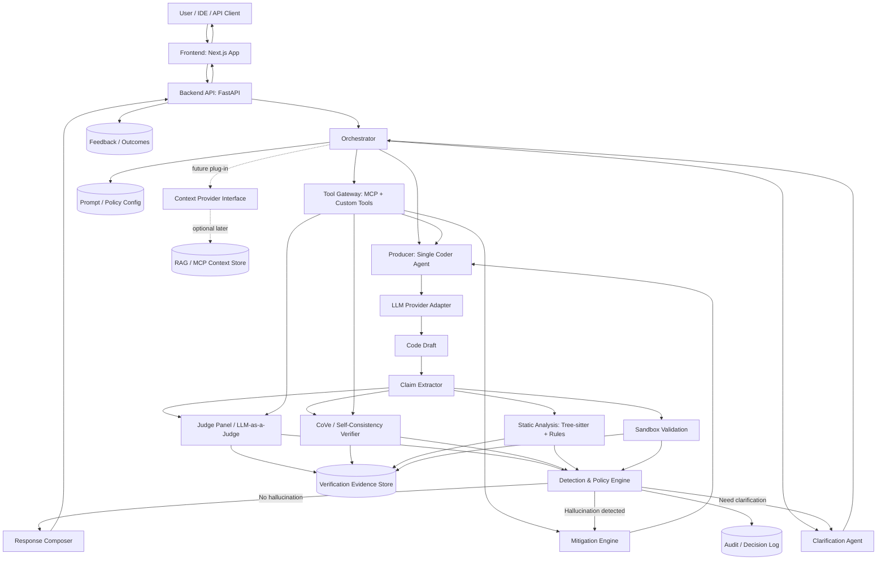

# DeHalu System Architecture

## Executive Summary

DeHalu is a language-agnostic hallucination detection and mitigation system for CodeLLMs. Its purpose is to sit between a single code-producing model and the final user response, detect hallucinated code artifacts before release, and trigger correction only when the detection layer finds meaningful risk.

The system is intentionally lightweight. It does not rely on GPU training, fine-tuning, or mandatory RAG. Instead, it combines `CrewAI`-orchestrated multi-agent verification with deterministic parsing and validation using `Tree-sitter`, bounded execution checks, and structured audit logging. The result is a maintainable, provider-agnostic architecture that can work with Gemini, Grok, Mistral, Cerebras, or a local coder model while remaining ready for future context integration.

The application should be split into a `backend/` and `frontend/` boundary from day one. The backend should be a Python `FastAPI` service that owns orchestration, verification, tool access, and state. The frontend should be a `Next.js` app that handles operator workflows, inspection views, and end-user interaction without embedding verification logic.

Recommended backend stack:

- `FastAPI` for API and orchestration entrypoints
- `Pydantic v2` and `pydantic-settings` for contracts and configuration
- `SQLAlchemy 2.x` + `Alembic` for durable state and migrations
- `PostgreSQL` for audit trails, runs, evidence, and feedback storage
- `Redis` optionally for short-lived run state, queues, and caching
- `httpx` for provider and tool integrations
- `structlog` or equivalent structured logging for traceable verification runs

Recommended frontend stack:

- `Next.js` App Router
- `TypeScript`
- server actions or route handlers only for frontend concerns
- typed API integration against backend OpenAPI schemas

## Architectural Principles

### 1. Lightweight by design

DeHalu uses inference-time controls instead of model retraining. Hallucination reduction comes from prompt structure, verifier coordination, static checks, and bounded runtime probes rather than model weight updates.

### 2. Deterministic before speculative

Prompt-based judgments are useful, but deterministic signals take priority when available. Syntax errors, unresolved imports, invalid symbols, and failed execution probes should override confident but weak LLM judgments.

### 3. Separation of concerns

Generation, parsing, verification, mitigation, provider integration, and audit storage are isolated into separate modules. No component should own both business orchestration and low-level validation logic.

### 4. Single producer, layered verification

The system assumes one primary coder agent per request. Verification complexity is added around that output rather than by generating multiple code drafts up front.

### 5. Provider-agnostic integration

All model providers are accessed through a common adapter boundary. Provider selection is a routing concern, not an orchestration concern.

### 6. RAG-ready without RAG dependence

The MVP does not require retrieval, but the architecture reserves a context-provider interface so external context can be introduced later without refactoring the verification loop.

### 7. Observable by default

Every decision in the pipeline should produce structured evidence. The system must be debuggable through logs and verification artifacts, not only through final pass/fail states.

## High-Level Diagram (Mermaid)



## Directory Structure

The project should be structured as a clean monorepo with explicit `backend/` and `frontend/` separation. The backend owns all DeHalu logic. The frontend is a thin product surface over backend APIs.

```text
dehalu/
├── backend/
│   ├── src/
│   │   └── dehalu/
│   │       ├── api/
│   │       ├── core/
│   │       ├── orchestration/
│   │       ├── agents/
│   │       ├── adapters/
│   │       │   ├── llm/
│   │       │   ├── language/
│   │       │   ├── tools/
│   │       │   └── context/
│   │       ├── verification/
│   │       │   ├── claims/
│   │       │   ├── judges/
│   │       │   ├── static_analysis/
│   │       │   ├── sandbox/
│   │       │   └── policy/
│   │       ├── mitigation/
│   │       ├── state/
│   │       ├── schemas/
│   │       ├── telemetry/
│   │       └── utils/
│   ├── tests/
│   │   ├── unit/
│   │   ├── integration/
│   │   ├── fixtures/
│   │   └── evaluation/
│   ├── alembic/
│   ├── pyproject.toml
│   └── Dockerfile
├── frontend/
│   ├── app/
│   ├── components/
│   ├── lib/
│   ├── hooks/
│   ├── types/
│   ├── public/
│   ├── package.json
│   └── next.config.ts
├── config/
│   ├── backend/
│   ├── frontend/
│   └── prompts/
├── docs/
├── scripts/
├── examples/
├── artifacts/
│   ├── audit/
│   ├── evidence/
│   └── reports/
├── Papers/
├── graphify-out/
├── System_Design.md
└── system_architecture.md
```

Core directory descriptions:

- `backend/src/dehalu/api/` — FastAPI routers, request handlers, and API wiring.
- `backend/src/dehalu/core/` — settings, dependency injection, security, and shared application bootstrap.
- `backend/src/dehalu/orchestration/` — top-level workflow control, routing, deadlines, and request lifecycle management.
- `backend/src/dehalu/agents/` — CrewAI agent definitions, task contracts, and crew assembly.
- `backend/src/dehalu/adapters/llm/` — provider wrappers for Gemini, Grok, Mistral, Cerebras, and local models.
- `backend/src/dehalu/adapters/language/` — language-specific parsing, symbol, import, and execution adapter interfaces.
- `backend/src/dehalu/adapters/tools/` — MCP connectors and custom tool wrappers exposed to agents.
- `backend/src/dehalu/adapters/context/` — future context-provider connectors for docs or retrieval systems.
- `backend/src/dehalu/verification/claims/` — claim extraction and normalization from coder outputs.
- `backend/src/dehalu/verification/judges/` — judge panel logic, CoVe logic, debate, consensus, and score fusion.
- `backend/src/dehalu/verification/static_analysis/` — Tree-sitter parsing, AST checks, dependency plausibility, and rule evaluation.
- `backend/src/dehalu/verification/sandbox/` — bounded compile, run, and probe execution layer.
- `backend/src/dehalu/verification/policy/` — threshold logic, hard-fail rules, and final detection decisions.
- `backend/src/dehalu/mitigation/` — repair, retry, clarification, downgrade, and fail-closed flows.
- `backend/src/dehalu/state/` — persistence interfaces for requests, evidence, audit artifacts, and feedback.
- `backend/src/dehalu/schemas/` — shared request, response, metric, and evidence models.
- `backend/src/dehalu/telemetry/` — structured logging, counters, traces, and monitoring hooks.
- `backend/src/dehalu/utils/` — small shared helpers with no domain ownership.
- `backend/tests/` — backend unit, integration, and evaluation tests.
- `backend/alembic/` — database migration scripts for audit and evidence storage.
- `frontend/app/` — Next.js App Router entrypoints and route-level UI composition.
- `frontend/components/` — reusable UI components for runs, evidence views, and admin pages.
- `frontend/lib/` — API client, request helpers, and frontend-side service utilities.
- `frontend/hooks/` — React hooks for polling runs, loading evidence, and managing UI state.
- `frontend/types/` — typed API contracts and generated frontend-facing schemas.
- `frontend/public/` — static assets.
- `config/backend/` — backend service settings, policy thresholds, and provider configs.
- `config/frontend/` — frontend runtime config and environment-specific UI settings.
- `config/prompts/` — managed prompt templates and verifier prompt variants.
- `docs/` — design docs, protocol docs, and operator guidance.
- `scripts/` — local dev, evaluation, and report-generation scripts.
- `examples/` — minimal example runs and sample request/response traces.
- `artifacts/audit/` — persisted decision logs for manual inspection.
- `artifacts/evidence/` — structured verification evidence emitted by each run.
- `artifacts/reports/` — generated summaries, evaluation outputs, and diagnostics.
- `Papers/` — source research corpus used to drive and justify design choices.
- `graphify-out/` — graph outputs and reports backing the current architecture reasoning.

## Component Breakdown

### Orchestration Layer

The orchestration layer is responsible for request lifecycle control. It should be implemented as a thin `CrewAI`-based coordination layer, not as a place for validation or provider-specific logic.

Primary responsibilities:

- normalize incoming requests and assign task metadata
- trigger clarification when the prompt is underspecified
- route one generation task to the selected coder model
- schedule verification tasks in parallel where safe
- collect evidence from all verification sub-systems
- broker MCP and custom-tool access through a controlled tool gateway
- call the detection policy engine
- trigger mitigation only after hallucination is detected

Recommended agents:

- `OrchestratorAgent` — owns workflow sequencing and deadlines
- `ClarificationAgent` — resolves missing constraints before generation
- `CoderAgent` — generates the single code draft
- `JudgeAgent` — performs structured hallucination scoring
- `CoVeAgent` — decomposes and re-checks claims
- `RepairAgent` — corrects code only after detection triggers mitigation

Tooling model:

- agents should receive tools through a backend-owned tool registry, not by directly embedding provider or MCP client code
- MCP tools and custom tools should be allowlisted per agent role
- tool calls should be budgeted by latency, risk level, and request scope
- tool outputs should be logged as first-class verification evidence

Design rule:

The orchestration layer should pass structured data objects between agents. It should not pass opaque prose where machine-readable forms are possible.

### Verification Layer

The verification layer is the core of DeHalu. It should combine prompt-based and deterministic validation in separate modules so their signals can be fused transparently.

#### A. Claim Extraction

Convert the coder output into structured claims:

- dependencies and packages
- APIs, symbols, and modules
- assumptions and environment requirements
- promised behaviors and side effects

This module should emit normalized claim objects that every downstream verifier can consume.

#### B. Static Analysis

Use `Tree-sitter` as the language-agnostic parsing foundation.

Primary checks:

- syntax validity
- AST shape validation
- import extraction
- symbol reference extraction
- unsupported construct detection
- language-specific rule execution through adapters

Tree-sitter should provide parse trees and structural features. Language-specific meaning, such as import resolution or symbol checks, should live in per-language adapters rather than in shared core logic.

#### C. AST and Rule Validation

On top of Tree-sitter, apply deterministic verification rules such as:

- non-existent import detection
- implausible API pattern detection
- unresolved symbol detection
- suspicious dependency usage
- mismatch between requested language and generated syntax
- dangerous or unsupported runtime assumptions

#### D. Sandbox Validation

The sandbox layer should run bounded execution checks when feasible:

- compile checks
- smoke-run checks
- generated assertion probes
- metamorphic tests for functions with invariant properties

Execution is optional per request and per language, but the architecture must support it cleanly.

#### E. Prompt-Based Verification

Prompt-based verification should not replace deterministic checks. It should evaluate:

- requirement alignment
- claim consistency
- unsupported assumptions
- semantic plausibility
- disagreement across judge agents

The judge subsystem may call multiple small or cloud models in parallel to reduce latency while still producing a single fused verdict.

### Adapter Layer

The adapter layer is how the system remains maintainable and provider-agnostic.

#### A. LLM Provider Adapters

Every model provider should implement a common interface, for example:

- `generate(request)`
- `judge(request)`
- `repair(request)`
- `healthcheck()`

Supported provider families:

- Gemini
- Grok
- Mistral
- Cerebras
- local model adapters such as Ollama

The rest of the system should not care about provider-specific HTTP payloads, auth methods, or retry behavior.

#### B. Language Adapters

Language adapters sit on top of Tree-sitter and provide language-aware behavior:

- parser selection
- import interpretation
- symbol resolution heuristics
- lint or type-check hooks
- sandbox strategy

This is what makes the system language-agnostic without forcing all languages through identical rules.

#### C. Context Adapters

These remain optional in the MVP. They expose a future interface for:

- MCP tools
- documentation lookup
- package metadata resolution
- repo-local context
- RAG-backed retrieval later

#### D. Tool Adapters

Tool adapters expose non-LLM capabilities to CrewAI agents in a controlled way.

Supported tool families should include:

- MCP tools
- custom internal tools
- documentation resolvers
- package registry lookups
- repository inspection tools
- deterministic validation helpers

Design rule:

Agents should depend on tool contracts defined in the backend adapter layer. That keeps MCP usage, custom tool invocation, auth, retries, and output normalization out of the agent logic itself.

### State Management

State management should be append-only, structured, and audit-friendly.

Persisted entities:

- normalized requests
- selected provider and prompt version
- raw coder output
- extracted claims
- judge outputs
- CoVe outputs
- static-analysis results
- sandbox outputs
- final detection decision
- mitigation actions
- user feedback

Recommended storage split:

- `decision log` — final verdicts, thresholds, and policy outcomes
- `evidence store` — structured artifacts from every verifier
- `run metadata` — timing, provider, model, retries, and correlation IDs

Design rule:

Verification evidence should be stored in machine-readable form first, human-readable reports second.

Backend ownership:

- the FastAPI backend owns all authoritative run state
- the Next.js frontend should be a consumer of backend APIs, not a source of orchestration truth
- frontend state should remain session/UI scoped and disposable

## Interaction Pattern

### Verification Loop

The core loop is:

`Generate -> Parse -> Validate -> Correct`

Detailed behavior:

1. `Generate`  
   The `CoderAgent` produces one code draft and a minimal structured envelope of assumptions and dependencies.

2. `Parse`  
   The claim extractor and Tree-sitter parser turn the draft into structured claims, AST features, imports, symbols, and execution candidates.

3. `Validate`  
   Validation runs across three channels in parallel where possible:
   - judge-based hallucination scoring
   - deterministic static analysis
   - bounded sandbox execution

4. `Detect`  
   The policy engine fuses metric scores and hard-fail flags into one hallucination decision.

5. `Correct`  
   Only if hallucination is detected:
   - ask for clarification
   - regenerate with stronger constraints
   - patch the output through a repair agent
   - fail closed if correctness cannot be established

6. `Return`  
   If no hallucination is detected, the response is returned directly with its evidence recorded.

The important constraint is that correction is conditional. DeHalu should not mutate outputs unless the detection layer finds a reason to intervene.

## Future-Proofing Roadmap

### Phase 1: MVP

Focus on:

- single coder agent
- CrewAI orchestration
- FastAPI backend + Next.js frontend split
- Tree-sitter-based parsing
- judge panel and CoVe verification
- static rule validation
- bounded sandbox checks
- controlled MCP/custom tool gateway
- structured evidence logging

No mandatory RAG, no model training, no vector database.

### Phase 2: Context Provider Interface

Once the MVP is stable, expand the `ContextProvider` interface under `backend/src/dehalu/adapters/context/`.

It should support:

- package registry lookups
- framework documentation lookup
- project-local code context
- MCP tool calls

At this stage, context can be used in two places:

- before generation, to reduce unsupported assumptions
- before repair, to resolve flagged uncertainty

### Phase 3: RAG / MCP Integration

If retrieval becomes necessary later, plug it into the existing context boundary rather than into the core orchestrator directly.

Recommended insertion points:

- `pre-generation grounding`
- `repair-time targeted lookup`
- `post-detection evidence enrichment`

Design constraint:

RAG should remain a dependency of the context layer, not of the base verification loop. That preserves the system's lightweight philosophy and keeps the MVP operable without retrieval infrastructure.
