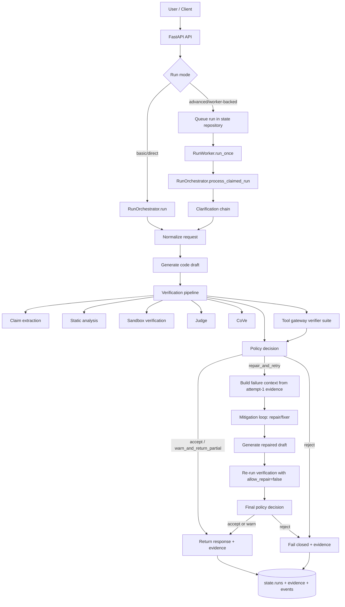

# DeHalu System Architecture

## Executive Summary

DeHalu is a language-agnostic hallucination detection and mitigation system for CodeLLMs. Its purpose is to sit between a single code-producing model and the final user response, detect hallucinated code artifacts before release, and trigger correction only when the detection layer finds meaningful risk.

The system is intentionally lightweight. It does not rely on GPU training, fine-tuning, or mandatory RAG. Instead, it combines `CrewAI`-orchestrated multi-agent verification with deterministic parsing and validation using `Tree-sitter`, bounded execution checks, and structured audit logging. The result is a maintainable, provider-agnostic architecture that can work with Gemini, Grok, Mistral, Cerebras, or a local coder model while remaining ready for future context integration.

Current implementation is backend-first. `backend/src/dehalu/` is the authoritative runtime for orchestration, verification, mitigation triggers, tool access, and state. A frontend boundary can be added later, but mitigation architecture and run lifecycle are currently owned by backend modules.

Recommended backend stack:

- `FastAPI` for API and orchestration entrypoints
- `Pydantic v2` and `pydantic-settings` for contracts and configuration
- `SQLAlchemy 2.x` + `Alembic` for durable state and migrations
- `PostgreSQL` for audit trails, runs, evidence, and feedback storage
- `Redis` optionally for short-lived run state, queues, and caching
- `httpx` for provider and tool integrations
- `structlog` or equivalent structured logging for traceable verification runs

Recommended frontend stack:

- `Next.js` App Router
- `TypeScript`
- server actions or route handlers only for frontend concerns
- typed API integration against backend OpenAPI schemas

## Architectural Principles

### 1. Lightweight by design

DeHalu uses inference-time controls instead of model retraining. Hallucination reduction comes from prompt structure, verifier coordination, static checks, and bounded runtime probes rather than model weight updates.

### 2. Deterministic before speculative

Prompt-based judgments are useful, but deterministic signals take priority when available. Syntax errors, unresolved imports, invalid symbols, and failed execution probes should override confident but weak LLM judgments.

### 3. Separation of concerns

Generation, parsing, verification, mitigation, provider integration, and audit storage are isolated into separate modules. No component should own both business orchestration and low-level validation logic.

### 4. Single producer, layered verification

The system assumes one primary coder agent per request. Verification complexity is added around that output rather than by generating multiple code drafts up front.

### 5. Provider-agnostic integration

All model providers are accessed through a common adapter boundary. Provider selection is a routing concern, not an orchestration concern.

### 6. RAG-ready without RAG dependence

The MVP does not require retrieval, but the architecture reserves a context-provider interface so external context can be introduced later without refactoring the verification loop.

### 7. Observable by default

Every decision in the pipeline should produce structured evidence. The system must be debuggable through logs and verification artifacts, not only through final pass/fail states.

## High-Level Diagram (Mermaid)

This flow makes mitigation explicit and first-class, while preserving both direct (`RunMode.basic`) and worker-backed (`RunMode.advanced`) execution paths.



## Directory Structure (Current Repository Alignment)

The implementation today is backend-centered and the mitigation pipeline is currently distributed across orchestration, verification policy, adapters, and state modules.

```text
SPL-3/
├── backend/
│   ├── src/dehalu/
│   │   ├── api/
│   │   ├── orchestration/
│   │   ├── verification/
│   │   │   ├── claims/
│   │   │   ├── judges/
│   │   │   ├── static_analysis/
│   │   │   ├── sandbox/
│   │   │   └── policy/
│   │   ├── adapters/
│   │   │   ├── llm/
│   │   │   ├── language/
│   │   │   └── tools/
│   │   ├── agents/
│   │   ├── state/
│   │   ├── schemas/
│   │   ├── core/
│   │   ├── telemetry/
│   │   └── worker.py
│   └── tests/
├── Papers/
├── graphify-out/
├── MITIGATION_PIPELINE_HIGH_LEVEL_DESIGN.md
└── System_Architecture.md
```

Current mitigation responsibility map (first-class in flow, distributed in code):

- **Mitigation orchestration and retry loop**  
  `backend/src/dehalu/orchestration/execution.py`  
  (`_ExecutionStages.generate_repair_output`, repair re-verification stages, max two-attempt flow)
- **Mode-aware orchestration (direct + worker-backed)**  
  `backend/src/dehalu/orchestration/service.py`, `backend/src/dehalu/worker.py`
- **Verification policy and mitigation trigger**  
  `backend/src/dehalu/verification/policy/engine.py`  
  (`repair_and_retry`, `reject`, `warn_and_return_partial`, `accept`)
- **Mitigation-capable provider/tool adapters**  
  `backend/src/dehalu/adapters/llm/*` (`repair(...)`) and `backend/src/dehalu/adapters/tools/gateway.py`
- **Mitigation state, evidence, and audit trail**  
  `backend/src/dehalu/state/repository.py`, `backend/src/dehalu/state/models.py`, `backend/src/dehalu/schemas/contracts.py`

Extension point for a future dedicated mitigation module:

- Add `backend/src/dehalu/mitigation/` only when mitigation logic outgrows current orchestration ownership.
- Keep current contracts stable (`RepairAttempt`, `RepairResult`, `PolicyDecision`) so the module can be introduced without API/schema churn.

## Component Breakdown

### Orchestration Layer

The orchestration layer is responsible for request lifecycle control. It should be implemented as a thin `CrewAI`-based coordination layer, not as a place for validation or provider-specific logic.

Primary responsibilities:

- normalize incoming requests and assign task metadata
- trigger clarification when the prompt is underspecified
- route one generation task to the selected coder model
- schedule verification tasks in parallel where safe
- collect evidence from all verification sub-systems
- broker MCP and custom-tool access through a controlled tool gateway
- call the detection policy engine
- trigger mitigation only after hallucination is detected

Recommended agents:

- `OrchestratorAgent` — owns workflow sequencing and deadlines
- `ClarificationAgent` — resolves missing constraints before generation
- `CoderAgent` — generates the single code draft
- `JudgeAgent` — performs structured hallucination scoring
- `CoVeAgent` — decomposes and re-checks claims
- `RepairAgent` — corrects code only after detection triggers mitigation

Tooling model:

- agents should receive tools through a backend-owned tool registry, not by directly embedding provider or MCP client code
- MCP tools and custom tools should be allowlisted per agent role
- tool calls should be budgeted by latency, risk level, and request scope
- tool outputs should be logged as first-class verification evidence

Design rule:

The orchestration layer should pass structured data objects between agents. It should not pass opaque prose where machine-readable forms are possible.

### Verification Layer

The verification layer is the core of DeHalu. It should combine prompt-based and deterministic validation in separate modules so their signals can be fused transparently.

#### A. Claim Extraction

Convert the coder output into structured claims:

- dependencies and packages
- APIs, symbols, and modules
- assumptions and environment requirements
- promised behaviors and side effects

This module should emit normalized claim objects that every downstream verifier can consume.

#### B. Static Analysis

Use `Tree-sitter` as the language-agnostic parsing foundation.

Primary checks:

- syntax validity
- AST shape validation
- import extraction
- symbol reference extraction
- unsupported construct detection
- language-specific rule execution through adapters

Tree-sitter should provide parse trees and structural features. Language-specific meaning, such as import resolution or symbol checks, should live in per-language adapters rather than in shared core logic.

#### C. AST and Rule Validation

On top of Tree-sitter, apply deterministic verification rules such as:

- non-existent import detection
- implausible API pattern detection
- unresolved symbol detection
- suspicious dependency usage
- mismatch between requested language and generated syntax
- dangerous or unsupported runtime assumptions

#### D. Sandbox Validation

The sandbox layer should run bounded execution checks when feasible:

- compile checks
- smoke-run checks
- generated assertion probes
- metamorphic tests for functions with invariant properties

Execution is optional per request and per language, but the architecture must support it cleanly.

#### E. Prompt-Based Verification

Prompt-based verification should not replace deterministic checks. It should evaluate:

- requirement alignment
- claim consistency
- unsupported assumptions
- semantic plausibility
- disagreement across judge agents

The judge subsystem may call multiple small or cloud models in parallel to reduce latency while still producing a single fused verdict.

### Adapter Layer

The adapter layer is how the system remains maintainable and provider-agnostic.

#### A. LLM Provider Adapters

Every model provider should implement a common interface, for example:

- `generate(request)`
- `judge(request)`
- `repair(request)`
- `healthcheck()`

Supported provider families:

- Gemini
- Grok
- Mistral
- Cerebras
- local model adapters such as Ollama

The rest of the system should not care about provider-specific HTTP payloads, auth methods, or retry behavior.

#### B. Language Adapters

Language adapters sit on top of Tree-sitter and provide language-aware behavior:

- parser selection
- import interpretation
- symbol resolution heuristics
- lint or type-check hooks
- sandbox strategy

This is what makes the system language-agnostic without forcing all languages through identical rules.

#### C. Context Adapters

These remain optional in the MVP. They expose a future interface for:

- MCP tools
- documentation lookup
- package metadata resolution
- repo-local context
- RAG-backed retrieval later

#### D. Tool Adapters

Tool adapters expose non-LLM capabilities to CrewAI agents in a controlled way.

Supported tool families should include:

- MCP tools
- custom internal tools
- documentation resolvers
- package registry lookups
- repository inspection tools
- deterministic validation helpers

Design rule:

Agents should depend on tool contracts defined in the backend adapter layer. That keeps MCP usage, custom tool invocation, auth, retries, and output normalization out of the agent logic itself.

### State Management

State management should be append-only, structured, and audit-friendly.

Persisted entities:

- normalized requests
- selected provider and prompt version
- raw coder output
- extracted claims
- judge outputs
- CoVe outputs
- static-analysis results
- sandbox outputs
- final detection decision
- mitigation actions
- user feedback

Recommended storage split:

- `decision log` — final verdicts, thresholds, and policy outcomes
- `evidence store` — structured artifacts from every verifier
- `run metadata` — timing, provider, model, retries, and correlation IDs

Design rule:

Verification evidence should be stored in machine-readable form first, human-readable reports second.

Backend ownership:

- the FastAPI backend owns all authoritative run state
- the Next.js frontend should be a consumer of backend APIs, not a source of orchestration truth
- frontend state should remain session/UI scoped and disposable

## Interaction Pattern

### Verification + Mitigation Loop

The core loop is:

`Normalize/Enhance -> Generate -> Verify -> Policy -> (Mitigate if needed) -> Re-verify -> Return`

Detailed behavior:

1. `Normalize + Enhance`  
   Request normalization runs first (`normalize_request` in orchestration), with clarification in worker-backed mode before generation.

2. `Generate`  
   The coder/generation provider produces one draft plus assumptions/dependency metadata.

3. `Verify`  
   Optional fast reviewer/tool pass can run via the tool gateway in advanced mode, then core verification runs.  
   Validation runs across three channels in parallel where possible:
   - judge-based hallucination scoring
   - deterministic static analysis
   - bounded sandbox execution

4. `Policy decision`  
   The policy engine fuses deterministic + judge/CoVe evidence and returns `accept`, `warn_and_return_partial`, `repair_and_retry`, or `reject`.

5. `Mitigate`  
   Only when policy returns `repair_and_retry`, orchestration builds a failure context from attempt-1 evidence, calls provider `repair(...)`, and reruns verification once with `allow_repair=False`.

6. `Return / fail closed`  
   - If final policy is acceptable, return code + report.  
   - If final policy is `reject`, fail closed with full evidence and audit state.

Important constraints:

- Mitigation is conditional on policy (`repair_and_retry`) and never unconditional.
- The same mitigation contract works in both direct execution and worker-backed execution.

## Future-Proofing Roadmap

### Phase 1: MVP

Focus on:

- single coder agent
- CrewAI orchestration
- FastAPI backend + Next.js frontend split
- Tree-sitter-based parsing
- judge panel and CoVe verification
- static rule validation
- bounded sandbox checks
- controlled MCP/custom tool gateway
- structured evidence logging

No mandatory RAG, no model training, no vector database.

### Phase 2: Context Provider Interface

Once the MVP is stable, expand the `ContextProvider` interface under `backend/src/dehalu/adapters/context/`.

It should support:

- package registry lookups
- framework documentation lookup
- project-local code context
- MCP tool calls

At this stage, context can be used in two places:

- before generation, to reduce unsupported assumptions
- before repair, to resolve flagged uncertainty

### Phase 3: RAG / MCP Integration

If retrieval becomes necessary later, plug it into the existing context boundary rather than into the core orchestrator directly.

Recommended insertion points:

- `pre-generation grounding`
- `repair-time targeted lookup`
- `post-detection evidence enrichment`

Design constraint:

RAG should remain a dependency of the context layer, not of the base verification loop. That preserves the system's lightweight philosophy and keeps the MVP operable without retrieval infrastructure.
