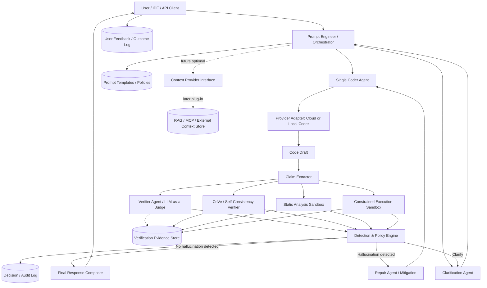

# Hallucination Detection and Mitigation System for CodeLLMs

## Executive Summary

This system is a lightweight, runtime-first verification gateway for CodeLLMs. Its objective is to reduce hallucinated code, APIs, dependencies, and implementation claims without training, fine-tuning, or heavy RAG infrastructure.

The MVP uses prompt engineering, multi-agent verification, static analysis, and constrained execution to validate generated code before release. It is designed to work with cloud-hosted models through `crewAI`, remain provider-agnostic across Gemini, Grok, Mistral, and Cerebras, and stay modular enough to accept future context modules such as MCP tools or RAG without architectural rework.

Primary evidence from the current graph:

- `LLM-as-a-Judge`
- `Execution-based Verification`
- `Static Analysis for Code Library Hallucinations`
- `Chain-of-Verification (CoVe)`
- `MetaQA Metamorphic Hallucination Detection`
- `LLM Monitoring Observability Guide`
- `Code Hallucination Taxonomy and Benchmarks`

## Design Principles

1. Lightweight first  
   The system must rely on inference-time controls and deterministic analysis rather than model retraining or vector indexing.

2. Deterministic checks before trust  
   Code should not be accepted solely because one model sounds confident. Static and runtime validation must override weak prompt-only confidence.

3. Provider-agnostic orchestration  
   No single model should be treated as the source of truth. Model diversity is used as a verification signal.

4. RAG-ready, not RAG-dependent  
   External context should plug into a stable interface later, but the MVP must function without retrieval.

5. Language-adapter architecture  
   The core flow must be language-agnostic. Language-specific logic belongs in adapters for parsing, static checks, and execution probes.

## Core Components

### 1. Prompt Engineer / Orchestrator

The top-level control plane. It accepts the user request, normalizes constraints, routes to providers, schedules verification passes, and decides when to clarify, retry, or return a result.

Responsibilities:

- Normalize task, language, constraints, and latency profile
- Choose provider mix and prompt templates
- Trigger clarification before generation when requirements are underspecified
- Coordinate verification and mitigation passes
- Maintain structured audit context for every request

Justification:

This is the natural architectural lift from the graph's `LLM-as-a-Judge` and provider-agnostic monitoring cluster.

Evidence:

- `LLM-as-a-Judge`
- `Datadog LLM-as-a-Judge Hallucination Detection Method`
- `Rationale: Black-box First for Provider-Agnostic Monitoring`
- `Rationale: Two-stage Prompting with Structured Output`

### 2. Clarification Agent

A lightweight pre-generation agent that improves ambiguous prompts before any expensive generation or verification occurs.

Responsibilities:

- Detect underspecified requests
- Ask for or infer missing constraints
- Produce a clarified spec for downstream generation

Use cases:

- Missing runtime environment
- Missing target language
- Missing framework or version assumptions
- Missing acceptance criteria

Justification:

Code hallucinations often start with ambiguous task framing. This is a lower-cost mitigation than post-hoc repair.

Evidence:

- `ClarifyGPT Requirements Clarification Framework` as a supporting node
- `Code Hallucination Taxonomy and Benchmarks`

Note:

The ClarifyGPT linkage is weaker than the main judge and verification clusters, so it should inform the design but not dominate it.

### 3. Coder Agent

Generates one primary code answer for each request. This can be a cloud CodeLLM or a local coder model, but the generation path is singular. The system does not rely on diversified `2-3` code answers as the main control mechanism.

Responsibilities:

- Produce one implementation attempt
- Force structured outputs: assumptions, dependencies, files touched, execution notes
- Separate final answer from hidden reasoning
- Emit enough metadata for downstream hallucination detection

Default strategy:

- One primary coder model is selected per request
- Provider choice can still vary by routing policy, but only one code draft enters the detection pipeline
- Regeneration happens only after hallucination is detected and mitigation is explicitly triggered

Justification:

The system objective is detection-first, not answer diversification. Hallucination control should come from verification depth and deterministic checks around a single coder output.

Evidence:

- `Code Hallucination Taxonomy and Benchmarks`
- `Systematic Literature Review of Code Hallucinations`
- `CoT Prompting Obscures Hallucination Cues`

Design note:

Use reasoning prompts internally when useful, but do not trust free-form CoT as a verification artifact.

### 4. Claim Extractor

A deterministic parser over the coder output that extracts claims requiring validation.

Responsibilities:

- Extract claimed dependencies and libraries
- Extract APIs, modules, endpoints, symbols, and file references
- Extract runtime or environment assumptions
- Extract claimed behavior and edge-case promises

Justification:

The system needs explicit objects to verify, not only full-text responses.

Evidence:

- `Code Hallucination Taxonomy and Benchmarks`
- `Systematic Literature Review of Code Hallucinations`

### 5. Verifier Agent / LLM-as-a-Judge

A structured hallucination detector that evaluates the single coder output against the clarified task and the extracted claims.

Responsibilities:

- Evaluate requirement alignment
- Detect missing functionality
- Flag implausible dependencies or APIs
- Produce structured verdicts, not free-form critique
- Score hallucination risk rather than ranking multiple code candidates
- Optionally run an internal judge panel where multiple SLLMs or cloud models debate in parallel before a final verdict is fused

Hallucination metrics:

- `requirement_alignment_score`
  Measures whether the code actually solves the requested task.
  Evidence: `LLM-as-a-Judge`, `Comprehensive Hallucination Detection Guide`

- `claim_consistency_score`
  Measures whether the code, explanation, and declared assumptions agree with each other.
  Evidence: `Chain-of-Verification (CoVe)`, `SelfCheckGPT`

- `dependency_plausibility_score`
  Measures whether packages, imports, and referenced libraries are real and appropriate.
  Evidence: `Static Analysis for Code Library Hallucinations`

- `api_symbol_validity_score`
  Measures whether referenced classes, functions, methods, and symbols are plausible for the chosen language or framework.
  Evidence: `Static Analysis for Code Library Hallucinations`

- `execution_validity_score`
  Measures whether the code compiles, runs, or passes bounded runtime probes.
  Evidence: `Execution-based Verification`, `CodeHalu Execution-based Verification`

- `metamorphic_stability_score`
  Measures whether behavior stays valid under invariant-preserving transformations or probe variations.
  Evidence: `MetaQA Metamorphic Hallucination Detection`, `Metamorphic Relations for Hallucination Detection`

- `judge_disagreement_score`
  Measures disagreement between judge models, verifier passes, or debate turns.
  Evidence: `LLM-as-a-Judge`, `LLM Monitoring Observability Guide`

- `unsupported_assumption_score`
  Measures how much of the answer depends on unstated, weakly justified, or unverifiable assumptions.
  Evidence: `Code Hallucination Taxonomy and Benchmarks`, `Systematic Literature Review of Code Hallucinations`

Output:

- hallucination likelihood
- hard-fail flags
- metric-level scores
- claim-level findings
- overall verdict and explanation

Justification:

The graph's strongest monitoring cluster centers on judge-based evaluation and structured two-stage prompting. Extending that into a small judge debate subsystem is consistent with the same cluster as long as the output is fused back into one structured verdict.

Evidence:

- `LLM-as-a-Judge`
- `Comprehensive Hallucination Detection Guide`
- `Datadog LLM-as-a-Judge Hallucination Detection Method`
- `LLM Monitoring Observability Guide`

### 6. CoVe / Self-Consistency Verifier

A second prompt-based verifier that re-checks coder claims independently through decomposition and regeneration.

Responsibilities:

- Break the answer into checkable subclaims
- Re-verify them independently
- Compare judge output against regenerated checks
- Surface disagreement as a first-class signal

Justification:

This replaces training-time calibration with runtime cross-examination.

Evidence:

- `Chain-of-Verification (CoVe)`
- `SelfCheckGPT`
- `CoT Prompting Obscures Hallucination Cues`

Design note:

This component should verify claims, not re-author the answer directly.

### 7. Static Analysis Sandbox

The first hard validation layer. It operates through language adapters and uses deterministic parsing and heuristics.

Responsibilities:

- Syntax and parse checks
- AST validation
- Import and symbol validation
- Dependency plausibility checks
- Optional linting and type checking
- Unsafe pattern detection

Adapter contract:

- `parse(code, language)`
- `check_imports(code, language)`
- `check_symbols(code, language)`
- `lint(code, language)`
- `typecheck(code, language)` when available

Justification:

This is the primary replacement for training-based "knowing" whether code is structurally valid.

Evidence:

- `Static Analysis for Code Library Hallucinations`
- `Code Hallucination Taxonomy and Benchmarks`
- `Systematic Literature Review of Code Hallucinations`

### 8. Constrained Execution Sandbox

A bounded runtime checker for code that can be compiled or executed safely.

Responsibilities:

- Compile or interpret candidate code
- Run smoke tests
- Run generated probes
- Execute metamorphic or invariant checks
- Capture runtime errors, import failures, missing package failures, and contract mismatches

Constraints:

- bounded CPU and memory
- short timeout
- isolated filesystem and network profile
- no privileged execution

Justification:

Execution-time failure is a stronger signal than prompt confidence for code hallucinations.

Evidence:

- `Execution-based Verification`
- `CodeHalu Execution-based Verification`
- `MetaQA Metamorphic Hallucination Detection`

### 9. Policy and Mitigation Engine

Fuses prompt-based and deterministic signals into a final release decision, with mitigation explicitly gated behind hallucination detection.

Decision states:

- `accept`
- `repair_and_retry`
- `clarify`
- `warn_and_return_partial`
- `reject`

Fusion inputs:

- hallucination likelihood
- hard-fail flags
- CoVe disagreement score
- static-analysis findings
- execution outcomes
- risk level of task
- latency budget remaining

Mitigation actions:

- ask clarifying question
- regenerate with stricter prompt
- patch the best candidate
- downgrade to explanation-only answer
- fail closed

Justification:

Mitigation must be explicit and policy-driven, not improvised per request. The system should not repair by default. It should first determine whether hallucination is actually present, then mitigate only when the detection layer crosses a threshold or triggers a hard-fail rule.

Evidence:

- `Mitigation Strategies`
- `Code Hallucination Taxonomy and Benchmarks`
- `Systematic Literature Review of Code Hallucinations`

### 10. Observability and Evidence Store

Stores all request-time evidence needed for debugging and improvement.

Persist:

- normalized request
- prompt version
- candidate outputs
- extracted claims
- judge reports
- CoVe reports
- static findings
- execution logs
- policy decision
- user feedback

Justification:

Without observability, prompt tuning becomes guesswork and failure patterns cannot be systematically reduced.

Evidence:

- `LLM Monitoring Observability Guide`
- `LLM-as-a-Judge`
- `Datadog LLM-as-a-Judge Hallucination Detection Method`

### 11. Language Adapter Layer

A pluggable interface for language-specific validation while keeping the orchestration language-agnostic.

Responsibilities:

- select parsers and tooling by language
- expose static-analysis and execution capabilities consistently
- degrade gracefully when only partial tooling exists

Required behavior:

- support a generic fallback adapter for unknown languages
- allow richer adapters for high-value languages later

Justification:

The system must support many languages without hardwiring the orchestration to one parser stack.

Evidence:

- `Static Analysis for Code Library Hallucinations`
- `Execution-based Verification`

### 12. Future Context Provider

A disabled-by-default interface for future RAG or MCP-based grounding.

Responsibilities:

- optionally resolve docs, package metadata, API references, or project-local context
- provide context before generation or before repair
- remain outside the MVP critical path

Justification:

The graph includes `Retrieval-Augmented Generation (RAG) Faithfulness`, but the MVP constraint is to avoid retrieval dependence.

Evidence:

- `Retrieval-Augmented Generation (RAG) Faithfulness`
- `LLM Monitoring Observability Guide`

## Architectural Diagram

## Request-Verify-Output Flow

1. The user submits a coding request through the gateway.
2. The orchestrator normalizes the request and assigns a task profile:
   - language hint
   - risk level
   - runtime capability
   - latency budget
3. If the request is underspecified, the clarification agent sharpens the requirements before generation.
4. The single coder agent produces one code draft using the selected cloud or local model.
5. The claim extractor converts that draft into structured claims:
   - dependencies
   - APIs
   - files or modules
   - assumptions
   - promised behavior
6. The verifier agent scores hallucination likelihood using the defined metrics. When latency allows, it can fan out judge prompts to multiple small or cloud models in parallel and fuse them through a compact debate or consensus pass.
7. The CoVe or self-consistency verifier independently re-checks critical claims.
8. The static analysis sandbox performs syntax, AST, import, symbol, and dependency plausibility checks.
9. The constrained execution sandbox runs compile or execute probes and lightweight generated tests when feasible.
10. The detection and policy engine merges all signals and chooses one outcome:
    - no hallucination detected, accept and return
    - hallucination detected, repair and retry
    - ask for clarification
    - return a constrained answer with warnings
    - reject
11. Mitigation is triggered only after hallucination is detected by threshold breach or hard-fail evidence such as invalid imports, impossible APIs, or failed execution probes.
12. All evidence and decisions are logged for later analysis.
13. User feedback is recorded to improve prompt templates, provider routing, and policy thresholds.

## Non-Training Mitigation Strategy

This system deliberately replaces fine-tuning and heavy retrieval with runtime controls.

### A. Prompt shaping

Use structured prompt templates that require:

- assumptions
- dependency declarations
- stepwise implementation intent
- explicit uncertainty markers

Why it matters:

This reduces hidden leaps and creates a machine-checkable surface.

Evidence:

- `LLM-as-a-Judge`
- `Datadog LLM-as-a-Judge Hallucination Detection Method`

### B. Multi-agent verification

Use one coder agent, then a multi-agent verification layer around that single output. The multi-agent part belongs in detection, not code generation.

Why it matters:

The system should distrust single-model confidence and treat disagreement as signal. Parallel judge calls can reduce wall-clock time while still allowing a debate or consensus subsystem inside `LLM-as-a-Judge`.

Evidence:

- `Chain-of-Verification (CoVe)`
- `SelfCheckGPT`
- `LLM-as-a-Judge`

### C. Static validation

Use AST, syntax, symbol, and dependency checks through language adapters.

Why it matters:

This catches library or API hallucinations without needing model updates.

Evidence:

- `Static Analysis for Code Library Hallucinations`

### D. Execution-based validation

Run bounded probes or tests where possible.

Why it matters:

Executable failure is stronger evidence than verbal confidence.

Evidence:

- `Execution-based Verification`
- `CodeHalu Execution-based Verification`

### E. Metamorphic checking

Use invariant-based tests when exact expected outputs are hard to specify.

Why it matters:

This gives a lightweight correctness signal for algorithmic or transformation code.

Evidence:

- `MetaQA Metamorphic Hallucination Detection`
- `Metamorphic Relations for Hallucination Detection`

### F. Observability-driven improvement

Track failures, disagreement rates, and repair success instead of retraining.

Why it matters:

Prompt and policy iteration becomes evidence-based.

Evidence:

- `LLM Monitoring Observability Guide`

## Why This Architecture Fits the Graph

The graph's strongest bridge node is `LLM-as-a-Judge`, connecting monitoring and reasoning-verification concepts. That makes judge-based evaluation the natural verification backbone.

The graph also shows a strong code-focused cluster around:

- `Execution-based Verification`
- `Static Analysis for Code Library Hallucinations`
- `Code Hallucination Taxonomy and Benchmarks`
- `Systematic Literature Review of Code Hallucinations`

That cluster supports a design where code outputs are validated through static and runtime checks rather than trusted as-is.

The graph's surprising connection between `CoT Prompting Obscures Hallucination Cues` and `LLM-as-a-Judge` adds an important design constraint: reasoning prompts may help generation, but reasoning text itself is not sufficient verification evidence. That is why the system uses structured judge outputs and deterministic checks instead of trusting chain-of-thought traces.

## Future-Proofing: Where RAG Fits Later

The MVP does not require RAG. When external context is added later, it should plug into the `Context Provider Interface` in two places:

1. Before generation  
   Inject documentation, package metadata, repository context, or API references.

2. Before repair  
   Resolve a flagged dependency, API, or framework question after the verifier has identified a specific uncertainty.

This preserves the MVP architecture while allowing later integration of:

- MCP tools
- project-local docs
- package registries
- Tavily or web lookup
- internal knowledge bases
- vector retrieval if needed later

The key rule is that external context remains optional and subordinate to the core verification loop.

## Validation Targets

The MVP should be evaluated on:

- hallucinated dependency detection rate
- hallucinated API or method detection rate
- static-analysis catch rate
- execution-based catch rate
- repair success rate after one retry
- false reject rate on correct code
- median and p95 latency
- evidence completeness per decision
- disagreement rate between judge and deterministic validators

## Current Defaults

- Orchestration layer: `crewAI`
- Providers: Gemini, Grok, Mistral, Cerebras via provider adapters
- Operating mode: online verification gateway
- Latency target: `5-15s`
- Coder count: `1`
- Judge panel size: `1-3` models depending latency budget
- No model training or fine-tuning in MVP
- No mandatory RAG in MVP
- Language support through adapters, not language-specific orchestration
- Fail closed when deterministic checks strongly contradict judge confidence

## Evidence Map

- `LLM-as-a-Judge` and `Datadog LLM-as-a-Judge Hallucination Detection Method`  
  Source: *Detecting hallucinations with LLM-as-a-judge: Prompt engineering and beyond*

- `LLM Monitoring Observability Guide`  
  Source: *LLM Monitoring: Detecting Drift, Hallucinations, and Failures*

- `Chain-of-Verification (CoVe)`  
  Source: *CHAIN-OF-VERIFICATION REDUCES HALLUCINATION in LLMs*

- `CoT Prompting Obscures Hallucination Cues`  
  Source: *Chain-of-Thought Prompting Obscures Hallucination*

- `Chain-of-Thought Prompting Elicits Reasoning in LLMs`  
  Source: *Chain-of-Thought Prompting Elicits Reasoning in LLMs*

- `Execution-based Verification` and `CodeHalu Execution-based Verification`  
  Source: *CodeHalu: Investigating Code Hallucinations in LLMs via Execution-based Verification*

- `Static Analysis for Code Library Hallucinations`  
  Source: *An Empirical Analysis of Static Analysis Methods for Detection and Mitigation of Code Library Hallucinations*

- `MetaQA Metamorphic Hallucination Detection`  
  Source: *Hallucination Detection in LLMs with Metamorphic Relation*

- `Code Hallucination Taxonomy and Benchmarks`  
  Source: *Hallucination by Code Generation LLMs: Taxonomy, Benchmarks, Mitigation*

- `Systematic Literature Review of Code Hallucinations`  
  Source: *Systematic Literature Review of Code Hallucinations*
